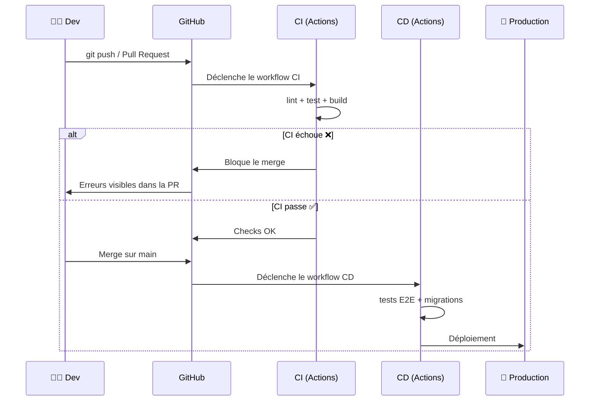

<!-- jump_to_middle -->

CI / CD
===

### avec GitHub Actions

_Automatiser les vérifications et le déploiement de son code_

<!-- end_slide -->

Le problème
===

<!-- pause -->

🤦 **"J'ai oublié de lancer les tests"**
Un bug passe en prod parce que personne n'a vérifié avant de merger

<!-- pause -->

🫣 **"On a mergé du code qui compile même pas"**
Pas de filet de sécurité → on le découvre trop tard

<!-- pause -->

😰 **"Le déploiement a raté, on rollback"**
Déployer à la main = étapes oubliées, erreurs humaines

<!-- pause -->

➡️  La CI/CD automatise ces vérifications et ces étapes.

<!-- end_slide -->

CI vs CD
===

<!-- column_layout: [1, 1] -->

<!-- column: 0 -->

### ✅ Continuous Integration

**Vérifier automatiquement** le code à chaque push ou pull request

- Lancer les tests
- Vérifier le linting
- Builder le projet

_But : détecter les erreurs le plus tôt possible_

<!-- column: 1 -->

### 🚀 Continuous Deployment

**Déployer automatiquement** quand le code est validé

- Déployer sur Vercel, Railway...
- Lancer les migrations DB
- Prévenir l'équipe

_But : livrer en production sans intervention manuelle_

<!-- end_slide -->

Quand est-ce qu'on l'utilise ?
===

**Réponse courte : dès qu'on travaille avec Git.**

<!-- pause -->

- **Projet solo** → Les tests tournent automatiquement, on ne peut plus "oublier"

<!-- pause -->

- **Projet en équipe** → Chaque PR est validée avant merge = filet de sécurité

<!-- pause -->

- **Open source** → Les contributeurs externes voient si leur code passe les checks

<!-- pause -->

- **En production** → Déploiement déclenché automatiquement à chaque merge sur `main`

<!-- end_slide -->

GitHub Actions — Les concepts
===

<!-- pause -->

### 📄 Workflow

Un **fichier YAML** qui décrit ce qu'on automatise.
→ vit dans `.github/workflows/`

<!-- pause -->

### ⚙️ Job

Un **groupe de tâches** qui tourne sur une machine.
→ un workflow peut avoir plusieurs jobs

<!-- pause -->

### 🔄 Step

Une **action individuelle** dans un job.
→ une commande (`run`) ou une action réutilisable (`uses`)

<!-- end_slide -->

Où va le fichier ?
===

<!-- column_layout: [3, 2] -->

<!-- column: 0 -->

```
mon-projet/
├── .github/
│   └── workflows/
│       └── ci.yml        ← ici !
├── src/
├── package.json
└── ...
```

<!-- column: 1 -->

Le chemin est **obligatoire** :

`.github/workflows/`

Le nom du fichier `.yml` est libre :
`ci.yml`, `tests.yml`, `deploy.yml`...

On peut avoir **plusieurs workflows** dans le même repo.

<!-- end_slide -->

Anatomie d'un workflow
===

<!-- column_layout: [1, 1] -->

<!-- column: 0 -->

```yaml
name: CI

on:
  push:
    branches: [main]
  pull_request:
    branches: [main]

jobs:
  check:
    runs-on: ubuntu-latest
    steps:
      - uses: actions/checkout@v4
      - uses: actions/setup-node@v4
      - run: npm ci
      - run: npm run lint
      - run: npm test
```

<!-- column: 1 -->

**`on:`** → Quand ça se déclenche ?
_push ou pull_request sur main_

<!-- new_lines: 2 -->

**`jobs:`** → Quelles tâches on exécute ?
_ici un seul job : "check"_

<!-- new_lines: 2 -->

**`runs-on:`** → Sur quelle machine ?
_ubuntu-latest (VM hébergée par GitHub)_

<!-- new_lines: 2 -->

**`steps:`** → Les étapes du job

- `uses:` → action réutilisable
- `run:` → commande shell

<!-- end_slide -->

Que met-on dans la CI ?
===

<!-- pause -->

### ✅ Linting

Vérifier le style et les erreurs de syntaxe (ESLint, Prettier)
→ `npm run lint`

<!-- pause -->

### 🐛 Tests

Lancer les tests unitaires et d'intégration (Jest, Vitest)
→ `npm test`

<!-- pause -->

### 🔨 Build

Vérifier que le projet compile sans erreurs (TypeScript, Next.js)
→ `npm run build`

<!-- end_slide -->

Que met-on dans la CD ?
===

<!-- pause -->

### 🧪 Tests (encore !)

On re-lance souvent les tests dans la CD, parfois **plus** de tests :
tests End-to-End (Playwright, Cypress) trop coûteux pour chaque push

<!-- pause -->

### 🗃️ Migrations DB

Lancer les migrations **avant** le déploiement
_drizzle-kit push, prisma migrate deploy..._

<!-- pause -->

### 📦 Déploiement

Déployer sur le provider (Vercel, Fly.io, AWS, Railway...)

<!-- pause -->

### 📢 Notifications

Prévenir l'équipe (Slack, Discord, email...)

<!-- end_slide -->

Pourquoi GitHub Actions pour le CD ?
===

Vercel, Netlify, Railway... déploient déjà automatiquement quand on push.

**Alors pourquoi passer par GitHub Actions ?**

<!-- pause -->

🔗 **Conditionner le déploiement** aux résultats de la CI
→ _on ne déploie que si les tests passent_

<!-- pause -->

📋 **Orchestrer un pipeline** avec un ordre précis
→ _tests → migrations → déploiement → notification_

<!-- pause -->

🏗️ **Déployer sur des providers sans intégration Git**
→ _un VPS, un serveur perso, AWS EC2, un cluster Kubernetes..._

<!-- pause -->

💡 _Si votre provider a une intégration Git et que vous n'avez pas de pipeline complexe, c'est très bien de l'utiliser directement !_

<!-- end_slide -->

Le flux complet
===



<!-- end_slide -->

Et si la CI échoue ?
===

<!-- pause -->

❌ **Le merge est bloqué**
→ On ne peut pas merger du code cassé sur `main`

<!-- pause -->

👀 **On voit les erreurs directement dans la PR**
→ GitHub affiche les logs du workflow

<!-- pause -->

🔁 **On corrige, on push, la CI re-tourne automatiquement**
→ Pas besoin de re-déclencher manuellement

<!-- end_slide -->

<!-- jump_to_middle -->

À vous de jouer ! 🎯
===

On va ajouter un workflow CI à un de vos projets.

<!-- end_slide -->

L'exercice
===

Sur **un de vos projets GitHub** (celui que vous voulez) :

<!-- incremental_lists: true -->

1. **Créer** le fichier `.github/workflows/ci.yml`
2. **Écrire** un workflow qui lance au minimum le **lint** (ou le **build**)
3. Si vous avez des tests : ajouter un step `npm test`
4. **Push** et aller voir l'onglet **Actions** sur GitHub
5. **Casser** volontairement le lint (ou un test) → voir le ❌
6. **Corriger** → voir le ✅

<!-- end_slide -->

Ressources
===

- 📖 **Quickstart GitHub Actions**
  `docs.github.com/en/actions/get-started/quickstart`

- 🛠️ **Building and testing Node.js**
  `docs.github.com/en/actions/tutorials/build-and-test-code/nodejs`

- 📁 **Starter workflows (exemples)**
  `github.com/actions/starter-workflows/tree/main/ci`

- 📚 **Comprendre GitHub Actions**
  `docs.github.com/en/actions/get-started/understand-github-actions`
