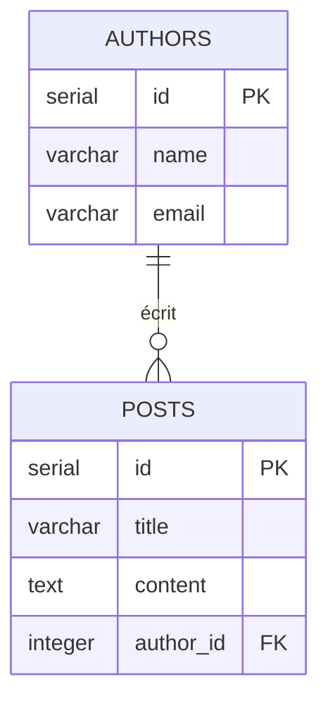

Votre expérience avec le SQL
===

<!-- jump_to_middle -->

<!-- alignment: center -->

Qu'est-ce qui vous a **plu** ou **frustré** quand vous écriviez vos requêtes SQL avec le driver PG ?

<!-- speaker_note: "Warm-up oral ~10min. Faire émerger les pain points - strings fragiles, pas d'autocomplétion, résultats any, typos sur les noms de colonnes, erreurs au runtime. Noter les réponses au tableau, on y reviendra." -->

<!-- end_slide -->

Bases de données relationnelles
===

Une base de données **relationnelle** organise les données en **tables** avec un **schema fixe** : chaque ligne a les mêmes colonnes, chaque colonne a un type défini.

Les tables peuvent être reliées entre elles par des **clés**.



**Vocabulaire** : table, colonne, type, primary key, foreign key

<!-- speaker_note: "Très rapide ~5min. On vérifie que le vocabulaire est là. Mentionner à l'oral que c'est ce qui distingue du NoSQL (pas de schema imposé). PostgreSQL, MySQL, SQLite = relationnels. MongoDB = NoSQL document." -->

<!-- end_slide -->

C'est quoi un ORM ?
===

**Object-Relational Mapping** : une couche qui fait le pont entre deux mondes.

<!-- pause -->

- **Object** — vos objets et types TypeScript
- **Relational** — vos tables SQL avec leur schema fixe
- **Mapping** — la traduction automatique entre les deux

<!-- pause -->

Concrètement : au lieu d'écrire du SQL en string et de récupérer des `rows` bruts, vous **décrivez vos tables dans le code** et vous **manipulez des objets typés**. L'ORM génère le SQL pour vous.

<!-- speaker_note: "~10min. Le Relational dans ORM fait référence aux bases de données relationnelles. Pour MongoDB on parlerait d'ODM (Object-Document Mapping). Faire le lien avec les pain points du warm-up." -->

<!-- end_slide -->

Drizzle : un ORM TypeScript léger
===

Drizzle est un ORM, mais dans la catégorie **légère** :

<!-- incremental_lists: true -->

- La syntaxe reste **très proche du SQL** que vous connaissez
- Pas de magie, pas de modèles abstraits
- Vous gardez le **contrôle** sur les requêtes générées
- Pensé pour TypeScript dès le départ : **tout est typé**

<!-- speaker_note: "On positionne Drizzle sans entrer dans les détails query builder vs ORM classique. Certains l'appellent un query builder typé, on peut le mentionner à l'oral." -->

<!-- end_slide -->

SQL vs Drizzle : SELECT
===

<!-- column_layout: [1, 1] -->

<!-- column: 0 -->

### Driver PG (SQL brut)

```ts
const result = await client.query(
  'SELECT * FROM users WHERE email = $1',
  ['alice@mail.com']
)
const user = result.rows[0] // any
```

<!-- column: 1 -->

### Drizzle

```ts
const user = await db
  .select()
  .from(users)
  .where(
    eq(users.email, 'alice@mail.com')
  )
// user est typé automatiquement
```

<!-- speaker_note: "Montrer la proximité, la structure est quasiment la même. Insister sur la différence de typage - à gauche c'est any, à droite c'est typé." -->

<!-- end_slide -->

SQL vs Drizzle : INSERT
===

<!-- column_layout: [1, 1] -->

<!-- column: 0 -->

### Driver PG (SQL brut)

```ts
const result = await client.query(
  `INSERT INTO users (name, email)
   VALUES ($1, $2)
   RETURNING *`,
  ['Alice', 'alice@mail.com']
)
const newUser = result.rows[0] // any
```

<!-- column: 1 -->

### Drizzle

```ts
const newUser = await db
  .insert(users)
  .values({
    name: 'Alice',
    email: 'alice@mail.com'
  })
  .returning()
// newUser est typé
```

<!-- speaker_note: "Même pattern. Le returning() existe des deux côtés, mais côté Drizzle le résultat est typé. Les étudiants connaissent déjà RETURNING côté SQL." -->

<!-- end_slide -->

Ce qu'on gagne avec un ORM comme Drizzle
===

<!-- incremental_lists: true -->

- **Autocomplétion** sur les noms de tables et colonnes
- **Erreurs de type à la compilation**, pas au runtime
- **Résultats typés** — plus de `rows[0].name as string`
- **Schema versionné** avec le code (Git)
- **Migrations automatisées** — on verra ça dans une prochaine session

<!-- speaker_note: "Récap des avantages. Faire le lien avec les pain points du début, chaque point ici répond à un problème qu'ils ont identifié." -->

<!-- end_slide -->

<!-- jump_to_middle -->

Le schema
===

<!-- end_slide -->

La notion de schema
===

Un **schema**, c'est la description de la structure d'une base de données :

- Quelles **tables** existent
- Quelles **colonnes** dans chaque table, avec quels **types**
- Quelles **contraintes** (clé primaire, unique, not null…)
- Quelles **relations** entre les tables (clés étrangères)

<!-- pause -->

Ce n'est pas un concept inventé par Drizzle. Quand vous avez écrit `CREATE TABLE`, vous avez défini un schema.

<!-- pause -->

La différence avec un ORM : cette description **vit dans votre code TypeScript** plutôt que dans un fichier SQL ou sur le dashboard Neon.

Avantages : **versionné** avec Git, **typé**, **source de vérité unique**.

<!-- speaker_note: "Bien insister, le schema c'est un concept général en BDD, pas propre à Drizzle. Le terme existe aussi dans d'autres contextes (JSON Schema, GraphQL Schema) — c'est toujours la même idée, décrire la structure des données." -->

<!-- end_slide -->

Un schema Drizzle
===

```ts
// L'équivalent SQL, pour référence :
// CREATE TABLE authors (
//   id SERIAL PRIMARY KEY,
//   name VARCHAR(255) NOT NULL,
//   email VARCHAR(255) UNIQUE
// );
// CREATE TABLE posts (
//   id SERIAL PRIMARY KEY,
//   title VARCHAR(255) NOT NULL,
//   content TEXT,
//   author_id INTEGER REFERENCES authors(id)
// );

export const authors = pgTable('authors', {
  id: serial('id').primaryKey(),
  name: varchar('name', { length: 255 }).notNull(),
  email: varchar('email', { length: 255 }).unique(),
})

export const posts = pgTable('posts', {
  id: serial('id').primaryKey(),
  title: varchar('title', { length: 255 }).notNull(),
  content: text('content'),
  authorId: integer('author_id').references(() => authors.id),
})
```

<!-- speaker_note: "Décortiquer le code ligne par ligne. Le SQL en commentaire c'est juste pour la slide, pas une convention de code. Mapping - pgTable = CREATE TABLE, serial().primaryKey() = SERIAL PRIMARY KEY, .references() = REFERENCES." -->

<!-- end_slide -->

Exercice : setup + schema
===

<!-- jump_to_middle -->

1. Créer une nouvelle base de données Neon
2. Suivre le Getting Started de Drizzle pour installer et configurer le projet
   → <https://orm.drizzle.team/docs/get-started/neon-new>
3. Écrire le schema des tables du projet; consultez la page dédiée pour plus de précisions sur la syntaxe → <https://orm.drizzle.team/docs/sql-schema-declaration>
4. Lancer `npx drizzle-kit push` et vérifiez sur Neon que les tables sont créées

<!-- speaker_note: "Circuler pour débloquer. Points de friction habituels - oublier @neondatabase/serverless, erreur dans drizzle.config.ts, confusion camelCase JS vs snake_case SQL. Faire un point collectif après pour vérifier que tout le monde a ses tables sur Neon." -->

<!-- end_slide -->

<!-- jump_to_middle -->

<!-- alignment: center -->

Pause ☕

<!-- end_slide -->

<!-- jump_to_middle -->

Les queries
===

<!-- end_slide -->

Queries de base
===

```ts
// SELECT — tous les posts d'un auteur
const authorPosts = await db
  .select()
  .from(posts)
  .where(eq(posts.authorId, 1))

// INSERT — créer un post
const newPost = await db
  .insert(posts)
  .values({ title: 'Mon premier post', authorId: 1 })
  .returning()

// UPDATE — modifier le titre
await db
  .update(posts)
  .set({ title: 'Titre modifié' })
  .where(eq(posts.id, 1))

// DELETE — supprimer un post
await db
  .delete(posts)
  .where(eq(posts.id, 1))
```

<!-- speaker_note: "Faire en live coding, pas juste projeter la slide. Le vrai moment - montrer l'autocomplétion et le typage dans l'éditeur. Insister sur le where pour UPDATE et DELETE, pas de modification/suppression sans condition !" -->

<!-- end_slide -->

Deux API pour les queries
===

Drizzle propose deux façons de récupérer un auteur avec ses posts :

<!-- column_layout: [1, 1] -->

<!-- column: 0 -->

### API SQL-like

```ts
const result = await db
  .select()
  .from(authors)
  .innerJoin(
    posts,
    eq(posts.authorId, authors.id)
  )
  .where(eq(authors.id, 1))
```

<!-- column: 1 -->

### API Relational queries

```ts
const result = await db.query.authors
  .findFirst({
    where: eq(authors.id, 1),
    with: {
      posts: true
    }
  })
```

<!-- speaker_note: "Même objectif, deux approches. À gauche on écrit le JOIN soi-même comme en SQL. À droite on déclare ce qu'on veut charger et Drizzle génère le JOIN. L'API Relational nécessite d'avoir défini les relations avec relations()." -->

<!-- end_slide -->

Deux API — la forme des résultats
===

<!-- column_layout: [1, 1] -->

<!-- column: 0 -->

### API SQL-like → résultat **à plat**

```json
[
  {
    "authors": { "id": 1, "name": "Alice" },
    "posts": { "id": 1, "title": "Post A" }
  },
  {
    "authors": { "id": 1, "name": "Alice" },
    "posts": { "id": 2, "title": "Post B" }
  }
]
```

Une ligne par combinaison auteur/post (comme un JOIN SQL classique).

<!-- column: 1 -->

### API Relational → résultat **imbriqué**

```json
{
  "id": 1,
  "name": "Alice",
  "posts": [
    { "id": 1, "title": "Post A" },
    { "id": 2, "title": "Post B" }
  ]
}
```

L'auteur est un objet, ses posts sont dans une liste. Prêt à utiliser.

<!-- speaker_note: "C'est LA différence clé. Le JOIN donne des lignes dupliquées qu'il faut regrouper soi-même. L'API relationnelle structure directement les données comme on les consommerait dans le front. Demander aux étudiants laquelle ils préfèrent et pourquoi."  -->

<!-- end_slide -->

Exercice : intégrer Drizzle dans le projet
===

<!-- jump_to_middle -->

**~20 minutes**

Remplacez 2-3 requêtes SQL brutes du projet par des queries Drizzle.

Utilisez l'API de votre choix (SQL-like ou relational).

Vérifiez que le résultat est le même.

<!-- speaker_note: "Circuler, débloquer, corriger au fil de l'eau. Si certains vont vite, leur proposer de tester l'API qu'ils n'ont pas utilisée, ou d'écrire une query plus complexe (filtre combiné avec and, tri avec orderBy)." -->
