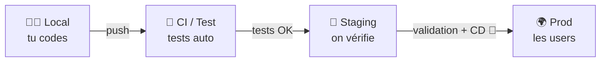

<!-- jump_to_middle -->

# Partie 1

## Les environnements de déploiement

<!-- end_slide -->

Les environnements de déploiement
==================================

Un **environnement de déploiement**, c'est un endroit où ton application tourne — avec sa propre URL, sa propre base de données, sa propre configuration.

<!-- pause -->

<!-- incremental_lists: true -->

- 🏠 **Local / Dev** — ton ordi
- 🧪 **Test** — pour les tests automatisés (local ou CI)
- 🎭 **Staging** — répétition générale
- 🚀 **Production** — les vrais utilisateurs

<!-- incremental_lists: false -->

<!-- end_slide -->

Le flux typique
===============



<!-- pause -->

Chaque étape est un **filet de sécurité**.
Un bug attrapé en staging n'atteint jamais la prod.

<!-- pause -->

**Tests** vs **validation** — deux choses différentes :

- **Tests** → vérification *automatique* : le code fait-il ce qu'il est censé faire ?
- **Validation** → vérification *humaine* : est-ce que tout fonctionne bien en conditions réelles, sur staging ?

<!-- end_slide -->

Local / Dev
===========

<!-- column_layout: [2, 1] -->

<!-- column: 0 -->

L'environnement sur **ton ordinateur**.

<!-- incremental_lists: true -->

- Base de données locale (ou Docker)
- **Seeds** : données de test (fausses, simulées)
- Hot-reload, logs verbeux, outils de debug
- Pas de vraies clés API (stripe, sendgrid…)

<!-- incremental_lists: false -->

<!-- pause -->

⚠️ Risque : **"ça marche chez moi"**
Ton env local diverge insidieusement du reste.

<!-- column: 1 -->

```
  Mon ordi
  ┌──────────┐
  │ app:3000 │
  │ db:5432  │
  │ .env     │
  │ node 22  │
  └──────────┘
```

<!-- reset_layout -->

<!-- end_slide -->

Test / CI
=========

L'environnement de **test** est conçu pour exécuter les tests automatisés dans des conditions stables et reproductibles.

<!-- pause -->

**Ses caractéristiques :**

<!-- incremental_lists: true -->

- Base de données isolée, remise à zéro entre les runs
- Pas de dépendances externes réelles (APIs tierces mockées)
- Éphémère dans la CI : créé pour le run, détruit ensuite

<!-- incremental_lists: false -->

<!-- pause -->

**Pourquoi un env séparé ?** Pour que les tests ne polluent pas les vraies données, et tournent toujours dans le même état connu — peu importe la machine ou le moment.

<!-- end_slide -->

Staging
=======

Le staging, c'est la **répétition générale** avant le spectacle.

<!-- pause -->

<!-- column_layout: [1, 1] -->

<!-- column: 0 -->

**Ce que c'est :**

- Une URL dédiée (`staging.monapp.com`)
- La même infra que la prod
- Des données réalistes (pas de prod)
- URL accessible, mais non indexée ni partagée*

<!-- column: 1 -->

**À quoi ça sert :**

- Tester une migration de BDD
- Valider une feature en conditions réelles
- QA manuel avant release
- Démo client sans risque

<!-- reset_layout -->

<!-- pause -->

*️⃣ *Aussi appelé **pre-prod**, **preview** ou **sandbox** selon les équipes.*

<!-- pause -->

**Règle d'or :** staging doit être le plus proche possible de la prod — même infra, même variables, même process de déploiement.

C'est là qu'intervient la **CD** : en utilisant le même code pour déployer en staging et en prod, on évite les surprises. Si ça marche en staging, ça marchera en prod.

<!-- pause -->

**Preview deployments :** selon le projet, deux approches :

- Une branche `staging` unique → on merge dedans avant `main`
- Des envs éphémères par branche (Vercel, Railway…) → on merge directement dans `main`

<!-- end_slide -->

Production
==========

<!-- column_layout: [1, 1] -->

<!-- column: 0 -->

La prod, c'est **sacré**.

<!-- incremental_lists: true -->

- Les vraies données utilisateurs
- Les vraies transactions
- Le vrai argent
- La vraie réputation

<!-- incremental_lists: false -->

<!-- column: 1 -->

```
       ⚠️  PROD  ⚠️

  ┌─────────────────┐
  │  myapp.com      │
  │  db: RDS prod   │
  │  10 000 users   │
  │  stripe LIVE    │
  └─────────────────┘
```

<!-- reset_layout -->

<!-- pause -->

**Règles non-écrites :**

- On ne teste jamais directement en prod
- On déploie en prod depuis un état connu (staging validé)
- On a toujours un plan de rollback

<!-- end_slide -->

<!-- jump_to_middle -->

# Partie 2

## L'environnement d'exécution

<!-- end_slide -->

Un environnement, c'est plus que "local vs prod"
=================================================

Quand on parle d'**environnement d'exécution**, on parle de tout ce qui entoure ton code quand il tourne.

<!-- pause -->

```
  ┌─────────────────────────────────────────┐
  │            ENVIRONNEMENT                │
  │                                         │
  │  ┌─────────┐  ┌────────┐  ┌─────────┐  │
  │  │  OS     │  │ Runtime│  │  Outils │  │
  │  │ Linux / │  │ Node / │  │ npm /   │  │
  │  │ macOS   │  │ Python │  │ git...  │  │
  │  └─────────┘  └────────┘  └─────────┘  │
  │                                         │
  │  ┌────────────────────────────────────┐ │
  │  │      Variables d'environnement     │ │
  │  │  DATABASE_URL, API_KEY, NODE_ENV…  │ │
  │  └────────────────────────────────────┘ │
  │                                         │
  │  ┌────────────────────────────────────┐ │
  │  │            TON CODE                │ │
  │  └────────────────────────────────────┘ │
  └─────────────────────────────────────────┘
```

<!-- end_slide -->

Ce qui compose un environnement
================================

<!-- incremental_lists: true -->

- **Système d'exploitation** — Linux ≠ macOS ≠ Windows (chemins, permissions, casse des fichiers…)
- **Runtime** — version de Node.js, Python, Ruby… Les APIs évoluent entre versions
- **Gestionnaire de paquets** — npm / yarn / pnpm et leurs versions
- **Dépendances installées** — versions exactes des packages
- **Variables d'environnement** — configuration externe au code
- **Outils système** — ImageMagick, ffmpeg, openssl… parfois requis par des packages natifs
- **Ressources réseau** — accès à une BDD, à une API tierce, à un bucket S3

<!-- incremental_lists: false -->

<!-- end_slide -->

Le problème de la divergence
=============================

Imagine une équipe de 4 devs + 1 serveur de staging + 1 prod.

```
  Dev A         Dev B         Dev C         Dev D
  Node 22       Node 20       Node 22       Node 18  ← 😱
  npm 10        npm 9         npm 10        npm 8
```

<!-- pause -->

> Chacun a installé Node "à sa façon", à des moments différents.

<!-- pause -->

**Conséquences :**

- Bug que seul Dev D reproduit
- "Ça marchait avant" après une mise à jour implicite
- Comportement différent en CI vs local

<!-- end_slide -->

<!-- jump_to_middle -->

# Partie 3

## Les variables d'environnement

<!-- end_slide -->

C'est quoi une variable d'environnement ?
==========================================

Une **variable d'environnement** est une valeur de configuration **externe au code**, fournie par le système au moment de l'exécution.

<!-- pause -->

```bash
# Dans ton terminal (bash/zsh) :
export DATABASE_URL="postgres://localhost:5432/mydb"
export NODE_ENV="development"
export SECRET_KEY="abc123"

# Ton programme peut les lire :
node app.js   # app.js accède à process.env.DATABASE_URL
```

<!-- pause -->

C'est un mécanisme **du système d'exploitation**, pas de Node ou Java.
Tous les langages peuvent y accéder.

<!-- end_slide -->

Pourquoi des variables d'environnement ?
=========================================

<!-- column_layout: [1, 1] -->

<!-- column: 0 -->

**Problème sans variables d'env :**

```javascript
// ❌ codé en dur dans le code
const db = new Client({
  host: "prod-db.myapp.com",
  password: "S3cr3t!"
})
```

- Impossible de changer sans modifier le code
- Credentials visibles dans le repo
- Même config pour tous les envs

<!-- column: 1 -->

**Avec variables d'env :**

```javascript
// ✅ lu depuis l'environnement
const db = new Client({
  connectionString: process.env.DATABASE_URL
})
```

- Chaque env a ses propres valeurs
- Secrets hors du code source
- Même code, configs différentes

<!-- reset_layout -->

<!-- end_slide -->

Le fichier `.env`
=================

En local, on ne veut pas `export` ses variables à la main. On utilise un fichier `.env` :

```bash
# .env
DATABASE_URL=postgres://localhost:5432/mydb
NODE_ENV=development
SECRET_KEY=abc123
PORT=3000
```

<!-- pause -->

Un outil comme **dotenv** charge ce fichier au démarrage de l'app :

```javascript
import 'dotenv/config'  // charge .env dans process.env
```

<!-- pause -->

⚠️ **Le `.env` ne doit jamais être commité dans git.**

<!-- pause -->

En revanche, on commite un **`.env.example`** avec des valeurs fictives — c'est la documentation des variables requises :

```bash
# .env.example  ← commité dans git
DATABASE_URL=postgres://localhost:5432/CHANGE_ME
SECRET_KEY=your-secret-key-here
STRIPE_KEY=sk_test_...
```

> Nouveau dev qui arrive sur le projet :
> `cp .env.example .env` → remplace les valeurs → c'est parti.

<!-- end_slide -->

Variables d'env en staging et prod
====================================

En dehors du local, on ne déploie **pas** de fichier `.env`.

<!-- pause -->

<!-- column_layout: [1, 1] -->

<!-- column: 0 -->

**Hébergeurs (Vercel, Railway, Fly…)**

Interface web ou CLI pour définir les variables :

```bash
vercel env add SECRET_KEY
railway variables set DATABASE_URL=...
```

Injectées au démarrage du conteneur.

<!-- column: 1 -->

**CI/CD (GitHub Actions…)**

```yaml
# .github/workflows/deploy.yml
env:
  DATABASE_URL: ${{ secrets.DATABASE_URL }}
  NODE_ENV: test
```

Stockées dans les "Secrets" du repo, jamais dans le code.

<!-- reset_layout -->

<!-- pause -->

**Règle d'or :** les secrets ne vivent jamais dans le code source, jamais dans git.

<!-- end_slide -->

<!-- jump_to_middle -->

# Partie 4

## Reproductibilité : éviter la divergence

<!-- end_slide -->

Verrouiller les versions de dépendances
========================================

Le `package.json` déclare des intervalles de versions.
Le **lockfile** fixe les versions exactes utilisées.

<!-- pause -->

```
package.json    →  "express": "^4.18.0"
                          ↓
package-lock.json  →  "express": "4.18.2"  ← version exacte
```

<!-- pause -->

<!-- column_layout: [1, 1] -->

<!-- column: 0 -->

**✅ Commiter le lockfile**

```bash
# npm
package-lock.json

# yarn
yarn.lock

# pnpm
pnpm-lock.yaml
```

<!-- column: 1 -->

**✅ Installer depuis le lockfile en CI**

```bash
# au lieu de npm install
npm ci

# yarn
yarn install --frozen-lockfile
```

<!-- reset_layout -->

<!-- end_slide -->

Documenter la version du runtime
==================================

`package.json` ne spécifie pas toujours la version de Node. Résultat : chaque dev installe "la dernière".

<!-- pause -->

**Solution : un fichier de versioning**

<!-- column_layout: [1, 1] -->

<!-- column: 0 -->

**`.nvmrc`** (pour nvm)

```
22.11.0
```

```bash
# dev installe la bonne version :
nvm use
# ou
nvm install
```

<!-- column: 1 -->

**`package.json` engines**

```json
{
  "engines": {
    "node": ">=22.0.0",
    "npm": ">=10.0.0"
  }
}
```

Avertissement si mauvaise version.

<!-- reset_layout -->

<!-- pause -->

D'autres outils : **volta**, **mise** (ex-rtx), **asdf** — gèrent Node, npm, Python, Ruby… depuis un seul fichier de config.

<!-- end_slide -->

Récap : checklist de reproductibilité
=======================================

<!-- incremental_lists: true -->

- ✅ Commiter le **lockfile** (`package-lock.json`, `yarn.lock`…)
- ✅ Fixer la version Node dans **`.nvmrc`** ou via `engines`
- ✅ Utiliser **`npm ci`** (pas `npm install`) en CI
- ✅ Commiter un **`.env.example`** avec des valeurs fictives
- ✅ Stocker les secrets dans les **variables de l'hébergeur ou de la CI**
- ✅ Documenter les dépendances système dans le **README**
- 🐳 *(avancé)* **Docker** pour isoler totalement l'environnement

<!-- incremental_lists: false -->

<!-- end_slide -->

<!-- jump_to_middle -->

Récap général
=============

<!-- end_slide -->

Les deux sens du mot "environnement"
=====================================

<!-- column_layout: [1, 1] -->

<!-- column: 0 -->

**Environnement de déploiement**

Où tourne l'app ?

```
local
  │
  ▼
CI / Test
  │
  ▼
Staging
  │
  ▼
Production
```

Chaque étape = un filet de sécurité.

<!-- column: 1 -->

**Environnement d'exécution**

Dans quel contexte tourne le code ?

```
OS
Runtime (Node…)
Dépendances
Variables d'env
Outils système
```

Un même code peut se comporter différemment selon ces facteurs.

<!-- reset_layout -->

<!-- end_slide -->

<!-- jump_to_middle -->

<!-- alignment: center -->

**Questions ?** 🙋
