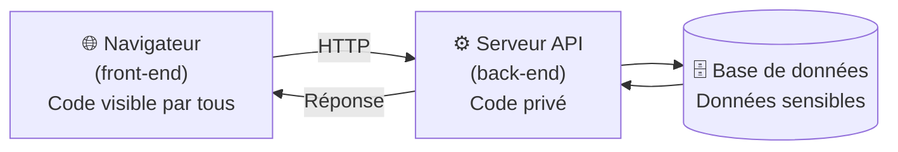

<!-- jump_to_middle -->

Qu'est-ce qu'on protège ?
=========================

<!-- end_slide -->

Imaginez que votre appli est en prod…
======================================

<!-- pause -->

- Un utilisateur modifie son identifiant dans une requête HTTP pour accéder aux données d'un autre
<!-- pause -->
- Quelqu'un soumet un formulaire avec un prix négatif
<!-- pause -->
- Un attaquant lit les données d'un autre utilisateur
<!-- pause -->
- Un script malveillant s'exécute dans le navigateur d'un visiteur

<!-- pause -->

<!-- new_lines: 1 -->

> La question n'est pas *si* votre appli sera attaquée, mais *quand*.

<!-- end_slide -->

Ce qu'on cherche à protéger
============================

<!-- incremental_lists: true -->

- 🗄️ **Les données** — email, mot de passe, coordonnées bancaires, messages privés
- 🔑 **Les accès** — s'assurer que c'est bien toi (authentification) et que tu en as le droit (autorisation)
- ⚙️ **L'intégrité** — empêcher qu'on modifie le prix d'une commande ou les droits d'un compte

<!-- incremental_lists: false -->

<!-- pause -->

<!-- new_lines: 1 -->

Ces trois axes vont structurer toute la suite.

<!-- end_slide -->

<!-- jump_to_middle -->

L'architecture, pour situer les acteurs
========================================

<!-- end_slide -->

Rappel : où se passe quoi ?
=============================



<!-- pause -->

<!-- new_lines: 1 -->

<!-- column_layout: [1, 1] -->

<!-- column: 0 -->

**Front-end**
- Tourne dans le navigateur de l'utilisateur
- Code source accessible à tous
- Peut être modifié, contourné

<!-- column: 1 -->

**Back-end**
- Tourne sur votre serveur
- Code source privé
- Seul endroit qu'on contrôle vraiment

<!-- reset_layout -->

<!-- end_slide -->

<!-- jump_to_middle -->

Le back-end : la ligne de défense qui compte
=============================================

<!-- end_slide -->

Ce que fait le back-end en matière de sécurité
===============================================

<!-- incremental_lists: true -->

- ✅ **Valider toutes les données** reçues du client (format, type, valeurs autorisées)
- ✅ **Authentifier** — vérifier que l'utilisateur est bien qui il prétend être
- ✅ **Autoriser** — vérifier qu'il a le droit de faire cette action
- ✅ **Protéger les secrets** — clés API, mots de passe (ne jamais exposer dans le code front-end)
- ✅ **Contrôler l'accès aux données** — ne renvoyer que ce que l'utilisateur peut voir

<!-- incremental_lists: false -->

<!-- pause -->

<!-- new_lines: 1 -->

> Le back-end ne fait pas confiance au front-end. Jamais.

<!-- end_slide -->

Authentification vs Autorisation
==================================

<!-- column_layout: [1, 1] -->

<!-- column: 0 -->

**Authentification** — "Qui es-tu ?"

Vérifier l'identité de l'utilisateur.

→ Login + mot de passe
→ Vérifier le token ou la session à chaque requête

<!-- column: 1 -->

**Autorisation** — "Tu peux faire ça ?"

Vérifier les droits de l'utilisateur.

→ Vérifier que le rôle est `admin` avant `/admin`
→ Vérifier qu'on accède bien à ses propres données

<!-- reset_layout -->

<!-- pause -->

<!-- new_lines: 1 -->

> Les deux sont faits côté **back-end**.

<!-- end_slide -->

<!-- jump_to_middle -->

Le front-end : utile, mais pas suffisant
=========================================

<!-- end_slide -->

Ce que peut faire le front-end
================================

Le front-end peut améliorer **l'expérience** de sécurité :

<!-- incremental_lists: true -->

- 🙈 Masquer un mot de passe dans un champ `type="password"`
- 🚫 Désactiver un bouton si un formulaire est incomplet ou invalide
- 🔐 Afficher en direct si un mot de passe respecte les règles (longueur, caractères…)
- 👁️ Ne pas afficher une section réservée aux admins
- ✍️ Indiquer qu'un champ est obligatoire avant soumission

<!-- incremental_lists: false -->

<!-- pause -->

<!-- new_lines: 1 -->

Mais **tout ça peut être contourné** par n'importe qui avec les DevTools.

<!-- end_slide -->

Les limites du front-end
=========================

<!-- column_layout: [1, 1] -->

<!-- column: 0 -->

**Ce que voit l'utilisateur**

```html
<button disabled>
  Réserver (complet)
</button>
```

<!-- column: 1 -->

**Ce que peut faire un attaquant**

```javascript
// Dans la console DevTools
document
  .querySelector("button")
  .removeAttribute("disabled")
```

<!-- reset_layout -->

<!-- pause -->

<!-- new_lines: 1 -->

<!-- incremental_lists: true -->

- Un champ `disabled` peut être réactivé en 2 secondes
- Une requête HTTP peut être copiée et modifiée avec Postman, Insomnia ou curl
- Le code JavaScript est lisible — les règles métier ne sont pas des secrets

<!-- incremental_lists: false -->

<!-- end_slide -->

<!-- jump_to_middle -->

Le piège classique
==================

<!-- end_slide -->

"Mais j'ai déjà vérifié côté front…"
======================================

Quelques situations réelles :

<!-- pause -->

<!-- column_layout: [1, 1] -->

<!-- column: 0 -->

**Le prix modifié**

Un e-commerce calcule le total en JS et l'envoie au serveur.
→ Un attaquant intercepte la requête et change le prix à `0.01`.

<!-- column: 1 -->

**L'identité usurpée**

Le front envoie `user_id: 42` dans la requête.
→ L'attaquant change la valeur en `43`.
→ Le back-end fait confiance sans vérifier la session.

<!-- reset_layout -->

<!-- pause -->

<!-- new_lines: 1 -->

**Le champ caché visible**

```html
<input type="hidden" name="user_id" value="42">
```

→ Visible dans le HTML source, modifiable avant soumission.

<!-- pause -->

<!-- new_lines: 1 -->

> Dans tous ces cas : le back-end n'a pas validé. C'est lui le coupable.

<!-- end_slide -->

À retenir
==========

<!-- incremental_lists: true -->

- 🔒 **Ne jamais faire confiance aux données qui viennent du client** — toujours revalider côté serveur
- 🎭 **Le front protège l'expérience**, le back protège les données
- 🙅 **La sécurité par l'obscurité ne marche pas** — cacher un bouton n'est pas sécuriser une route
- 🗝️ **Les secrets n'ont pas leur place dans le front-end** — clés API, tokens, logique critique

<!-- incremental_lists: false -->

<!-- pause -->

<!-- new_lines: 2 -->

<!-- alignment: center -->

Et maintenant… on va voir ça en vrai. 🔍

<!-- end_slide -->
