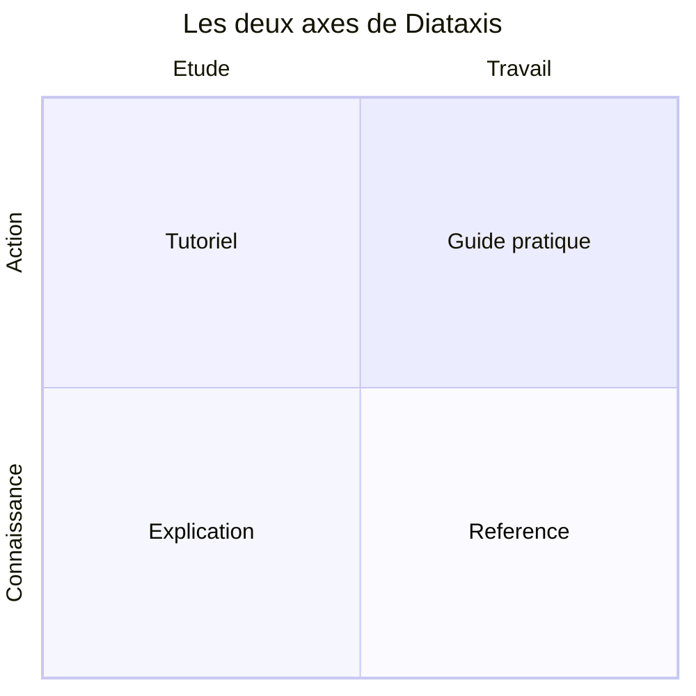

<!-- jump_to_middle -->

# 1. Les README

<!-- end_slide -->

## Deux README, deux publics

- Le **README d'installation** répond à : *comment je démarre ce projet sur ma machine ?*
- Le **README d'exploitation** répond à : *comment je le fais tourner en prod, comment je vérifie qu'il va bien, comment je le dépanne ?*

<!-- pause -->

En dev, tu as le contexte : l'éditeur ouvert, l'historique des commits, la mémoire de ce que tu viens de casser.

En exploitation, tu peux avoir **zéro** de tout ça — et un service muet.

<!-- end_slide -->

## Ce que la doc d'exploitation doit couvrir

<!-- incremental_lists: true -->

- Comment démarrer le service
- Quelles variables d'environnement sont nécessaires
- Comment vérifier qu'il fonctionne
- Où regarder quand ça casse
- Comment le relancer proprement

<!-- incremental_lists: false -->

<!-- pause -->

Ce n'est pas de la littérature. **C'est un mode d'emploi**, écrit pour quelqu'un qui n'a pas ton contexte.

<!-- end_slide -->

## L'endpoint `/health` : à quoi il sert

Un endpoint qui répond en une requête : *est-ce que ce service va bien ?*

```json
GET /health
→ 200 {"status": "ok", "db": "connected"}
→ 503 {"status": "degraded", "db": "unreachable"}
```

<!-- pause -->

> On ne vérifie pas toujours la connexion à la DB dans cet endpoint. Le principal est de tester si le serveur a bien démarré sans erreur.

### `/health` — en local

- Un réflexe après avoir démarré le serveur : `curl localhost:3000/health` avant de tester quoi que ce soit à la main.
- Ça confirme en une commande que le process tourne **et** que la BDD répond — sans avoir à ouvrir l'app pour le découvrir.
- Certains `docker-compose.yml` utilisent une directive `healthcheck` qui appelle cet endpoint : un service B ne démarre que quand le `/health` du service A dont il dépend répond correctement.

<!-- pause -->


### `/health` — en production

C'est là que l'endpoint devient critique, pour deux familles d'outils :

<!-- pause -->

**Le load balancer.** Avant d'envoyer du trafic vers une instance, il l'interroge. Une instance qui ne répond pas à `/health` (ou répond en 503) est retirée de la rotation — elle ne reçoit plus une seule requête utilisateur.

<!-- pause -->

**Les systèmes de déploiement.** Lors d'un déploiement (rolling, blue-green), la nouvelle instance est démarrée *à côté* de l'ancienne. Le trafic n'est basculé vers elle **qu'une fois** que son `/health` répond `ok` — sinon le déploiement est annulé et l'ancienne version continue de servir.

<!-- pause -->

C'est le même principe derrière les *readiness probes* de Kubernetes.

<!-- end_slide -->

<!-- jump_to_middle -->

# 2. Structurer sa doc avec Diátaxis

<!-- end_slide -->

## Le réflexe qui ne marche pas

Un README qui grossit : installation, architecture, endpoints, procédures de restart, historique des décisions — tout au même endroit.

<!-- pause -->

Résultat : la dev pressée qui cherche une commande tombe sur un paragraphe d'architecture. Personne ne s'y retrouve, et plus personne ne la met à jour.

<!-- pause -->

**Diátaxis**, développé par Daniele Procida et adopté par Django, Cloudflare ou Gatsby pour restructurer leur doc, part d'un constat simple : il n'existe pas *une* documentation, mais quatre besoins différents, qu'il ne faut jamais mélanger.

## Deux questions, pas quatre catégories arbitraires

Diátaxis ne liste pas quatre cases au hasard : elles naissent du croisement de deux axes.

<!-- pause -->

**Axe 1 — Action ou connaissance ?**
Le lecteur est-il en train de *faire* quelque chose, ou cherche-t-il à *savoir* quelque chose ?

<!-- pause -->

**Axe 2 — Étude ou travail ?**
Est-il en train d'apprendre (il acquiert une compétence), ou d'exécuter une tâche (il applique une compétence qu'il a déjà) ?

<!-- end_slide -->

## Le croisement des deux axes



<!-- end_slide -->

## Les quatre types

| Type | Répond à | Dans votre projet | Exemple connu |
|---|---|---|---|
| Tutoriel | Aide-moi à démarrer | README, guide de prise en main | *Writing your first Django app* |
| How-to | Comment je fais X ? | Runbook, procédures d'incident | *How to accept a payment* (Stripe) |
| Référence | C'est quoi, exactement ? | Doc API, variables d'env | Référence API de Stripe |
| Explication | Pourquoi c'est comme ça ? | ADR, doc d'architecture | Pages *Concepts* de Kubernetes |

<!-- pause -->

Un **README classique** mélange souvent les quatre à la fois — c'est exactement le problème que Diátaxis résout.

<!-- pause -->

## Le piège

Un tutoriel qui explique **pourquoi** on a choisi PostgreSQL perd la personne qui voulait juste démarrer.

Une référence qui raconte une histoire fait perdre du temps à celle qui cherchait le nom exact d'une variable.

<!-- pause -->

> Diátaxis est explicite là-dessus : dans un tutoriel, l'explication *distrait* l'apprenant de l'action — elle a sa place, mais ailleurs, en lien, pas intégrée.

<!-- pause -->

**Un document = un type = un besoin.**

<!-- pause -->

## À qui s'adresse la doc ?

<!-- incremental_lists: true -->

- **La dev qui rejoint l'équipe** — aucun contexte, tout expliciter → tutoriel
- **L'équipe projet au quotidien** — cherche une info précise et rapide → référence
- **L'équipe ops / astreinte** — sous pression, parfois la nuit → runbook, README d'exploitation
- **La future repreneuse** — doit comprendre les intentions avant de modifier → explication, ADR
- **Toi dans six mois** — la destinataire qu'on oublie toujours

<!-- incremental_lists: false -->

<!-- end_slide -->

## Où stocker la doc ?

**Ce qui décrit le code vit avec le code** — *docs-as-code*.

- Markdown versionné dans le dépôt
- Mêmes branches, mêmes PR, même revue
- Si le code change et que la doc devient fausse, la doc est corrigée **dans la même PR**

<!-- pause -->

Ce qui n'est pas lié au code (comptes rendus, roadmap, notes d'équipe) peut vivre ailleurs — Notion, wiki, Drive.

<!-- pause -->

> La doc dans le dépôt, c'est aussi ce qu'un agent IA peut lire et modifier directement. Une doc sur Notion ou Drive lui est inaccessible — il ne peut pas la maintenir à jour quand il touche au code.

## Arborescence type

```
lovelace-factory/
├── README.md              # Installation + prise en main (tutoriel)
├── docs/
│   ├── exploitation.md    # Démarrer / vérifier / dépanner (how-to)
│   ├── runbook/           # Procédures d'incident (how-to)
│   │   ├── restart-apres-crash.md
│   │   └── bdd-inaccessible.md
│   ├── api.md             # Endpoints, formats, codes retour (référence)
│   ├── architecture.md    # Vue d'ensemble, choix structurants (explication)
│   └── adr/               # (explication)
│       ├── 001-postgres-vs-mongo.md
│       └── 002-jwt-stateless.md
├── src/
└── .env.example           # Référence des variables attendues
```

<!-- pause -->

Si le code change et que la doc devient fausse → la correction est dans **la même PR**.

<!-- end_slide -->

<!-- jump_to_middle -->

# 3. À vous de jouer

<!-- end_slide -->

## Exercice 1 — L'endpoint `/health`

En groupe, dans votre projet :

<!-- incremental_lists: true -->

1. Implémentez `GET /health` : renvoie `200 {"status": "ok", "db": "connected"}` si la BDD répond, `503 {"status": "degraded", "db": "unreachable"}` sinon
2. Testez : mettez une URL incorrecte dans `.env`, relancez, vérifiez que vous obtenez bien un 503
3. Remettez la bonne URL, vérifiez le 200

<!-- incremental_lists: false -->


## Exercice 2 — Le README d'exploitation

Créez `docs/exploitation.md`. Il doit répondre à trois questions :

<!-- pause -->

- **Comment démarrer ?** Les variables d'environnement requises et la commande de lancement.
- **Comment vérifier que ça tourne ?** Ce que renvoie `/health`, comment l'appeler, comment interpréter la réponse.
- **Où regarder quand ça casse ?** Les logs, les premières vérifications, les causes les plus courantes.

<!-- pause -->

> Test : donnez votre fichier à une autre personne du groupe. Peut-elle démarrer le service en le lisant seule, sans vous poser de question ?

## Exercice 3 — Auditer et réorganiser

Pour chaque fichier de doc existant dans votre projet :

<!-- pause -->

- **1. À quelle question répond ce fichier ?**
- **2. À qui s'adresse-t-il ?**
- **3. Quel type Diátaxis est-ce ?** Si vous ne pouvez pas répondre → il **mélange deux types**.

<!-- pause -->

Créez un dossier `/docs`, un fichier par besoin. README racine = prise en main + sommaire vers `/docs` uniquement.
