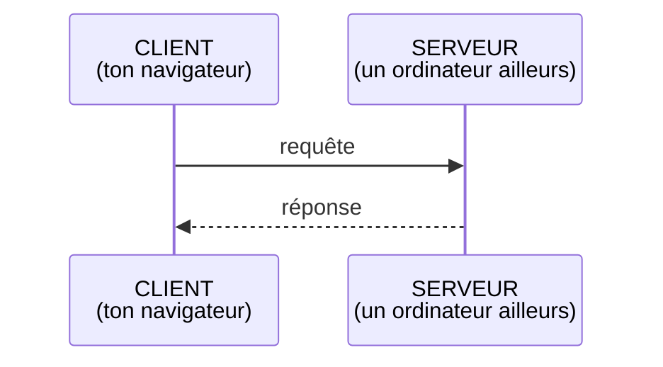
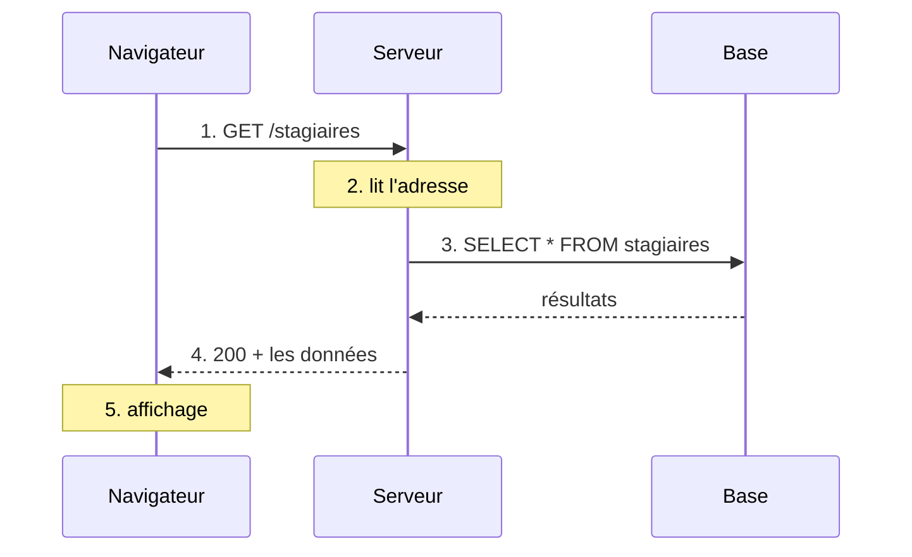

<!-- jump_to_middle -->

# Une seule question

Quand tu tapes une adresse et que tu appuies sur Entrée,
**qu'est-ce qui se passe, dans l'ordre**, jusqu'à ce que la page s'affiche ?

<!-- end_slide -->

<!-- jump_to_middle -->

# Le seul modèle à retenir

<!-- end_slide -->

## Client, serveur, requête, réponse



<!-- pause -->

- Le **client** demande, le **serveur** répond
- Toujours dans ce sens : le serveur ne parle jamais le premier
- Une requête → une réponse. Rien d'autre.

<!-- pause -->

Une page, une image, un script, un bouton « Enregistrer » : **à chaque fois, une requête et une réponse**.

<!-- end_slide -->

## Le voyage d'une requête



<!-- pause -->

L'étape 3 n'existe pas toujours : une image ou un fichier `.css` se lisent sans base.

<!-- pause -->

Hier, vous avez écrit l'étape 3. Aujourd'hui, on s'occupe de 1, 4 et 5.

<!-- end_slide -->

## Anatomie d'une requête

```http
GET /stagiaires HTTP/1.1
Host: lovelace-factory.fr
Accept: application/json
```

<!-- pause -->

- Un **verbe** : ce que je veux faire (`GET`)
- Une **adresse** : sur quoi (`/stagiaires`)
- Des **en-têtes** : des infos en plus (qui je suis, ce que j'accepte)
- Parfois un **corps** : des données envoyées (un formulaire, par exemple)

<!-- end_slide -->

## Anatomie d'une réponse

```http
HTTP/1.1 200 OK
Content-Type: application/json

[{ "id": 1, "prenom": "Léna", "nom": "Henry" }]
```

<!-- pause -->

- Un **code** : est-ce que ça s'est bien passé (`200`)
- Des **en-têtes** : dont le **type** du contenu (`Content-Type`)
- Un **corps** : ce qu'on a demandé

<!-- pause -->

Le corps peut être une **page** (`text/html`) ou des **données** (`application/json`).
Une API renvoie des données, pas une page.

<!-- end_slide -->

<!-- jump_to_middle -->

# Les verbes

<!-- end_slide -->

## Quatre verbes, quatre commandes SQL

| HTTP | Intention | SQL (hier) |
|---|---|---|
| `GET /stagiaires` | lire | `SELECT * FROM stagiaires;` |
| `POST /stagiaires` | créer | `INSERT INTO stagiaires ...;` |
| `PATCH /stagiaires/3` | modifier | `UPDATE stagiaires SET ... WHERE id = 3;` |
| `DELETE /stagiaires/3` | supprimer | `DELETE FROM stagiaires WHERE id = 3;` |

<!-- pause -->

- `PUT` remplace la ressource **entière**, `PATCH` n'en modifie **qu'une partie**
- Le `3` dans l'adresse joue le rôle du `WHERE id = 3`

<!-- pause -->

L'API est la **porte d'entrée**, la base est **derrière**. On ne parle jamais à la base directement depuis le navigateur.

<!-- end_slide -->

## À toi : quel verbe ?

<!-- incremental_lists: true -->

- J'affiche la liste des promos
- Je m'inscris sur la plateforme
- Je change mon mot de passe
- Je supprime mon compte
- Je tape une adresse dans la barre du navigateur

<!-- incremental_lists: false -->

<!-- end_slide -->

<!-- jump_to_middle -->

# Les codes de réponse

<!-- end_slide -->

## Le premier chiffre suffit

| Famille | Sens | Qui a un problème ? |
|---|---|---|
| `2xx` | succès | personne |
| `3xx` | redirection | personne, on te renvoie ailleurs |
| `4xx` | erreur côté client | **la requête** |
| `5xx` | erreur côté serveur | **le serveur** |

<!-- pause -->

## Les codes à connaître

| Code | Nom | Pour toi |
|---|---|---|
| `200` | OK | tu as ce que tu as demandé |
| `201` | Created | ton `POST` a créé quelque chose |
| `301` | Moved Permanently | cette adresse a définitivement déménagé |
| `400` | Bad Request | il manque un champ, ou le format est faux |
| `401` | Unauthorized | il faut être connectée |
| `404` | Not Found | cette adresse n'existe pas |
| `500` | Internal Server Error | le serveur a planté, ce n'est pas toi |

<!-- end_slide -->

## À toi : quel code ?

<!-- incremental_lists: true -->

- Je tape `/stagaires` au lieu de `/stagiaires`
- J'envoie le formulaire d'inscription sans email
- Mon inscription vient d'être enregistrée
- Je demande `/stagiaires/99`, il n'y a pas de stagiaire 99 en base
- Le serveur n'arrive pas à se connecter à la base de données
- J'essaie de supprimer un projet sans être connectée

<!-- incremental_lists: false -->

<!-- end_slide -->

<!-- jump_to_middle -->

# JSON

<!-- end_slide -->

## Un objet JavaScript écrit en texte

<!-- column_layout: [1, 1] -->

<!-- column: 0 -->

**Objet JavaScript**

```javascript
const stagiaire = {
  prenom: 'Léna',
  age: 30,
  promo: { id: 1 },
};
```

<!-- column: 1 -->

**JSON**

```json
{
  "prenom": "Léna",
  "age": 30,
  "promo": { "id": 1 }
}
```

<!-- reset_layout -->

<!-- pause -->

- **Guillemets doubles** sur les clés, et sur les chaînes
- **Pas de virgule finale**, pas de commentaire

<!-- pause -->

JSON, c'est **du texte**. Il faudra le transformer en vrai tableau JavaScript pour s'en servir.

<!-- end_slide -->

## Et un tableau de stagiaires en JSON…

```json
[
  { "id": 1, "prenom": "Léna", "promo": { "id": 1, "nom": "Promo Paris - Février 2024" } },
  { "id": 2, "prenom": "Lucas", "promo": { "id": 1, "nom": "Promo Paris - Février 2024" } }
]
```

<!-- pause -->

Le `JOIN` d'hier (`stagiaires` + `promos`) devient ici un **objet dans un objet**.

<!-- pause -->

Comment une page va chercher ce JSON ? **On le code ensemble.**

<!-- end_slide -->
