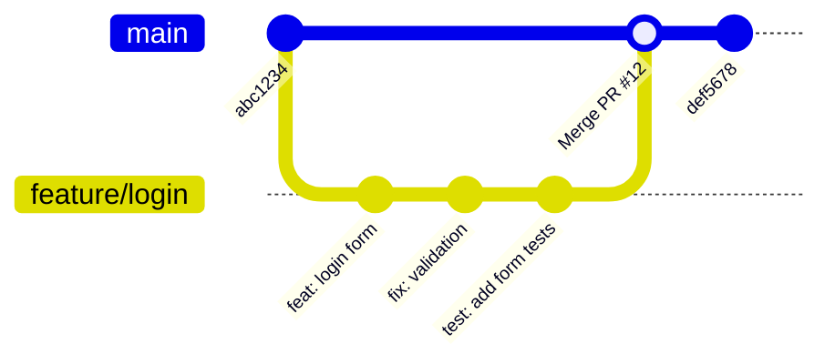

<!-- end_slide -->

<!-- jump_to_middle -->

Rappels
=======

<!-- end_slide -->

Rappel — CI/CD
===============

**CI (Intégration Continue)** : vérifier automatiquement que chaque modification ne casse rien.

**CD (Déploiement Continu)** : publier / mettre en ligne les changements

<!-- pause -->

Le principe :

<!-- incremental_lists: true -->

- Des évènements (souvent, des commits) déclenchent un **pipeline**
- Le pipeline exécute des vérifications : lint, tests, build…
- Si une vérification échoue → le changement est bloqué
- Si tout passe → on peut merger / déployer en confiance

<!-- incremental_lists: false -->

<!-- pause -->

> Aujourd'hui : mettre en place la CI sur vos PRs et **bloquer le merge** si elle échoue.

<!-- end_slide -->

Rappel — Tests automatisés
============================

| Type | Outils | Ce qu'ils testent |
|---|---|---|
| **Unitaires** | Vitest/Jest (JS), JUnit (Java) | Une fonction ou module isolé |
| **Intégration** | Vitest/Jest (JS), JUnit (Java) | Une page web / route HTTP dans sa globalité  |
| **E2E** | Playwright | L'application entière dans un vrai navigateur |

<!-- pause -->

> Les tests n'ont de valeur en CI que s'ils **tournent automatiquement** à chaque changement.
> C'est exactement ce qu'on va configurer aujourd'hui.

<!-- end_slide -->

<!-- jump_to_middle -->

GitHub Actions
==============

<!-- end_slide -->

Workflow → Job → Step
======================

<!-- column_layout: [1, 1] -->

<!-- column: 0 -->

```
workflow (.github/workflows/deploy.yml)
│
├── on: [push]
│
├── job: checks
│   ├── step: checkout
│   ├── step: npm ci
│   ├── step: npm run lint
│   └── step: npx vitest run
│
└── job: deploy
    ├── needs: checks
    ├── step: checkout
    ├── step: npm ci
    ├── step: npm run build
    └── step: vercel/action@v1
```

<!-- column: 1 -->

**Workflow** — définit les triggers (`on:`), contient les jobs.

**Jobs**

- En **parallèle par défaut**
- Avec `needs:` : dépendance entre jobs — `deployment` attend que `checks` réussisse ; si `checks` échoue, `deployment` est annulé
- Chaque job tourne sur une **VM isolée et fraîche**
- Un job n'a **pas accès aux fichiers** des autres jobs
- Pour partager des fichiers entre jobs → **artifacts** (`upload-artifact` / `download-artifact`)

**Steps**

- **Séquentiels**, même machine, même filesystem
- Partagent les variables d'environnement et les processus démarrés
- Si le step 3 installe des dépendances, le step 4 y a directement accès

<!-- reset_layout -->

<!-- pause -->

> Jobs isolés : c'est pour ça que chaque job refait `checkout` et `npm ci`, il repart d'une machine vierge. C'est normal, pas un bug.

<!-- end_slide -->

Les triggers principaux
========================

| Trigger | Quand | Usage typique |
|---|---|---|
| `push` | À chaque push sur une branche | Déploiement automatique (CD) |
| `pull_request` | Ouverture, nouveau commit, draft→ready | **CI principale** |
| `workflow_dispatch` | Déclenchement manuel | Migration, déploiement manuel |
| `schedule` | Cron | Audit de dépendances, smoke tests |

<!-- pause -->

> `pull_request` et `pull` créent un **check associé à un commit précis**.
> Nouveau commit lié à une pull request → si le workflow échoue, le **merge est bloqué**

<!-- end_slide -->

Le workflow Git qu'on suit
===========================

<!-- column_layout: [1, 1] -->

<!-- column: 0 -->



<!-- column: 1 -->

<!-- incremental_lists: true -->

1. `git checkout main`
2. `git pull`
3. `git checkout -b feature/login`
4. Commits sur la branche
5. Ouvrir une **Pull Request** vers `main`
6. Les checks CI tournent sur chaque push ensuite
7. Checks verts ✅ → on peut **merger**

<!-- incremental_lists: false -->

<!-- reset_layout -->

<!-- pause -->

> Dans une équipe, en général vous aurez un deuxième "bloquage": la review humaine.
> Il vous faudra demander à un·e collègue de relire votre code et "approuver" la pull request pour merger dans `main`.

<!-- end_slide -->

<!-- jump_to_middle -->

Plusieurs jobs
==============

<!-- end_slide -->

Un job ou plusieurs ?
======================

<!-- column_layout: [1, 1] -->

<!-- column: 0 -->

**Tout dans un job**

```yaml
jobs:
  ci:
    runs-on: ubuntu-latest
    steps:
      - run: npm run lint
      - run: npm run typecheck
      - run: npx vitest run
      - run: npx playwright test
```

- ✅ Simple, pas de `needs:`
- ✅ Pas de double `npm ci`
- ❌ Pas de parallélisme
- ❌ Impossible de conditionner un niveau

<!-- column: 1 -->

**Plusieurs jobs**

```yaml
jobs:
  checks:
    runs-on: ubuntu-latest
    steps: [...]

  e2e: # exécution après le job checks
    if: !draft
    needs: checks
    runs-on: ubuntu-latest
    steps: [...]

  preview-deployment: # exécution en parallèle
    runs-on: ubuntu-latest
    steps:
      - run:
```

- ✅ Parallélisme possible
- ✅ Conditions différentes par job
- ✅ Logs séparés dans l'UI
- ❌ Chaque job repart de zéro (nouvelle VM, `npm ci` à refaire)

<!-- reset_layout -->

<!-- pause -->

> Pas de règle universelle — on découpe quand on a une raison :
> parallélisme, condition différente, ou lisibilité des logs.

<!-- end_slide -->

Protection de branches
=======================

GitHub peut **bloquer le merge** si un check échoue.

<!-- pause -->

**Configurer la branch protection sur `main` :**

Settings → Branches → Add branch ruleset

Les règles recommandées partout :

- **Require status checks to pass** → sélectionner tous vos jobs de tests
- **Require a pull request before merging** → interdit les push directs sur `main`
- **Do not allow bypassing** → s'applique aussi aux admins

<!-- pause -->

Autres règles courantes :

- **Require branches to be up to date** → évite de merger une branche obsolète
- **Require approvals** → un·e collègue doit approuver la PR avant le merge

<!-- pause -->

> Un push direct sur `main` sans passer par une PR sera **rejeté**.
> C'est l'objectif : tout le code passe par une PR, donc par la CI.

<!-- end_slide -->

<!-- jump_to_middle -->

À vous de jouer 🎯
==================

<!-- end_slide -->

L'exercice
===========

Objectif : écrire un workflow CI, configurer la protection des branches, et observer le comportement sur une vraie PR. Sur un projet au choix.

Aller sur les instructions détaillées: `https://gist.github.com/alxqtn/fd7c037d492809f23890e584dac030fc`
