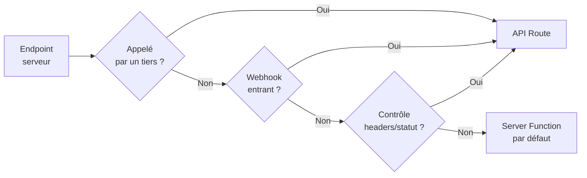

Trois endroits où Next.js exécute du code serveur
==================================================

<!-- column_layout: [1, 1, 1] -->

<!-- column: 0 -->

**React Server Components**

Charger des données
pour rendre la page

```typescript
// app/users/page.tsx
export default async function Page() {
  const users = await db
    .select()
    .from(usersTable)

  return <UserList users={users} />
}
```

<!-- column: 1 -->

**API Routes**

Endpoints HTTP
exposés publiquement

```typescript
// app/api/users/route.ts
export async function POST(req: Request) {
  const body = await req.json()
  const [user] = await db.insert(usersTable)
    .values({ name: body.name })
    .returning()
  return Response.json(user, { status: 201 })
}
```

<!-- column: 2 -->

**Server Functions**

Fonctions serveur
appelables depuis le client

```typescript
// actions.ts
"use server"

export async function createUser(
  formData: FormData
) {
  const name = formData.get("name") as string
  const [user] = await db.insert(usersTable)
    .values({ name })
    .returning()
  return user
}
```

<!-- reset_layout -->

<!-- pause -->

> **Focus du cours** : pour les **actions utilisateur** après le chargement de la page — les deux derniers.

<!-- end_slide -->

Les formulaires HTML : le chaînon manquant
==========================================

<!-- column_layout: [1, 1, 1] -->

<!-- column: 0 -->

**Étape 1**
JS + fetch
`"use client"` nécessaire

```tsx
<form onSubmit={async (e) => {
  e.preventDefault()
  await fetch("/api/users", {
    method: "POST",
    body: JSON.stringify({ name })
  })
}}>
  <input name="name" />
  <button>Créer</button>
</form>
```

```typescript
// route.ts
export async function POST(
  req: Request
) {
  const { name } = await req.json()
  await db.insert(usersTable)
    .values({ name })
  return Response.json({ ok: true })
}
```

<!-- column: 1 -->

**Étape 2**
HTML pur
Aucun `"use client"`

```html
<form
  action="/api/users"
  method="POST"
>
  <input name="name" />
  <button>Créer</button>
</form>
```

```typescript
// route.ts
export async function POST(
  req: Request
) {
  const formData = await req.formData()
  const name =
    formData.get("name") as string
  await db.insert(usersTable)
    .values({ name })
  return Response.redirect(
    new URL("/users", req.url), 303
  )
}
```

<!-- column: 2 -->

**Étape 3**
Server Function
Aucun `"use client"`

```tsx
<form action={createUser}>
  <input name="name" />
  <button>Créer</button>
</form>
```

```typescript
// actions.ts
"use server"
import { redirect } from "next/navigation"

export async function createUser(
  formData: FormData
) {
  const name =
    formData.get("name") as string
  await db.insert(usersTable)
    .values({ name })
  redirect("/users")
}
```

<!-- reset_layout -->

<!-- end_slide -->

API Routes — anatomie
=====================

> Si vous avez fait Express, c'est le même principe : on manipule des objets qui représentent des requêtes et des réponses, on lit les headers, les cookies, on contrôle le statut HTTP.

```typescript
// app/api/users/route.ts
import { NextRequest } from "next/server"
// NextRequest étend le Request standard avec des utilitaires supplémentaires (.cookies, etc.)

export async function POST(req: NextRequest) {
  const body = await req.json()           // body parsé manuellement

  if (!body.name) {
    return Response.json(                 // contrôle total sur le statut
      { error: "Name required" },
      { status: 400 }
    )
  }

  const [user] = await db.insert(usersTable)
    .values({ name: body.name })
    .returning()
  return Response.json(user, { status: 201 })
}

export async function GET(req: NextRequest) {
  const { searchParams } = new URL(req.url)  // accès aux query params
  const users = await db.select().from(usersTable)
  return Response.json(users)
}
```

<!-- pause -->

<!-- column_layout: [1, 1] -->

<!-- column: 0 -->

**Entrée** : objet `Request`
- headers, body, query params
- méthode HTTP explicite
- cookies : `req.cookies.get()` ou `cookies()` de `next/headers`

<!-- column: 1 -->

**Sortie** : objet `Response`
- statut HTTP, headers, body
- format libre (JSON, texte, stream…)

<!-- reset_layout -->

<!-- end_slide -->

Server Functions — anatomie
============================

```typescript
// actions.ts
"use server"

// Via <form> — reçoit du FormData
export async function createUser(formData: FormData) {
  const name = formData.get("name") as string
  const [user] = await db.insert(usersTable)
    .values({ name })
    .returning()
  return user
}

// Ou appelée directement — arguments libres
export async function deleteUser(id: string) {
  const session = await getSession() // renvoie la session ou null
  if (!session) throw new Error("Non autorisé")
  await db.delete(usersTable).where(eq(usersTable.id, id))
}
```

<!-- pause -->

```tsx
// Deux façons d'appeler

// 1. Via <form> (pas besoin de "use client")
<form action={createUser}>
  <input name="name" />
  <button type="submit">Créer</button>
</form>

// 2. Directement depuis un Client Component
<button onClick={() => deleteUser(user.id)}>Supprimer</button>
```

<!-- pause -->

<!-- column_layout: [1, 1] -->

<!-- column: 0 -->

**Entrée** : `FormData` ou arguments libres

**Sortie** : valeur JS sérialisable

<!-- column: 1 -->

**Méthode HTTP** : toujours `POST` (géré par Next.js)

**URL** : gérée par Next.js, pas destinée à être appelée directement

<!-- reset_layout -->

> ⚠️ L'endpoint est public — toujours vérifier l'auth à l'intérieur (cf. slide sécurité)

<!-- end_slide -->

Comparaison
===========

| | API Route | Server Function |
|---|---|---|
| **Protocole** | HTTP explicite | HTTP POST (géré par Next.js) |
| **URL** | Stable, publique | Gérée par Next.js — pas stable, pas destinée à être appelée directement |
| **Entrée** | `Request` (objet requête) | `FormData` ou arguments libres |
| **Sortie** | `Response` (objet réponse) | Valeur JS sérialisable |
| **Méthodes HTTP** | GET, POST, PUT… | POST uniquement |
| **Statut HTTP** | Contrôle total | Pas d'accès direct |
| **`<form action>`** | URL en string | Fonction directement |

> Les appels sont visibles dans le DevTools (Network > Fetch/XHR)

<!-- pause -->

<!-- column_layout: [1, 1] -->

<!-- column: 0 -->

```typescript
// API Route
export async function POST(req: Request) {
  const { name } = await req.json()
  const [user] = await db.insert(usersTable)
    .values({ name })
    .returning()
  return Response.json(user, { status: 201 })
}

// Appelé via fetch
await fetch("/api/users", {
  method: "POST",
  body: JSON.stringify({ name })
})
```

<!-- column: 1 -->

```typescript
// Server Function
"use server"
export async function createUser(
  formData: FormData
) {
  const name = formData.get("name") as string
  const [user] = await db.insert(usersTable)
    .values({ name })
    .returning()
  return user
}

// Appelé directement (ou via <form>)
await createUser(formData)
```

<!-- reset_layout -->

<!-- end_slide -->

⚠️ Sécurité — point critique
=============================

Une Server Function **n'est pas une fonction privée**.

<!-- pause -->

```
POST /_next/action/a1b2c3d4...
```

C'est un endpoint HTTP comme un autre — appelable par n'importe qui avec `curl`.

<!-- pause -->

```typescript
"use server"

export async function deletePost(postId: string) {
  // ❌ Dangereux — n'importe qui peut appeler cet endpoint
  await db.delete(postsTable).where(eq(postsTable.id, postId))
}

export async function deletePost(postId: string) {
  // ✅ 1. Vérifier que l'utilisateur est connecté
  const session = await getSession()
  if (!session) throw new Error("Non autorisé")

  // ✅ 2. Vérifier que le post lui appartient
  const post = await db.query.postsTable.findFirst({
    where: eq(postsTable.id, postId)
  })
  if (post?.userId !== session.userId) throw new Error("Accès refusé")

  await db.delete(postsTable).where(eq(postsTable.id, postId))
}
```

> Même règle que pour les API Routes : **tout endpoint exposé doit être protégé**.

<!-- end_slide -->

Quand utiliser quoi ?
=====================



<!-- pause -->

> **Webhook** : appel HTTP envoyé par un service tiers (Stripe, GitHub…) vers ton serveur pour te notifier d'un événement.

<!-- pause -->

<!-- column_layout: [1, 1] -->

<!-- column: 0 -->

**Server Function par défaut pour les fonctionnalités internes…**
- Formulaire dans l'UI
- Bouton qui déclenche une action
- Meilleure gestion du cache (revalidation automatique possible)

<!-- column: 1 -->

**API Route si…**
- API consommée par une app mobile ou un partenaire
- Besoin de contrôler les headers, le statut HTTP, le format d'entrée/de sortie, l'URL
- Webhook Stripe / GitHub (appel depuis l'extérieur)

<!-- reset_layout -->
