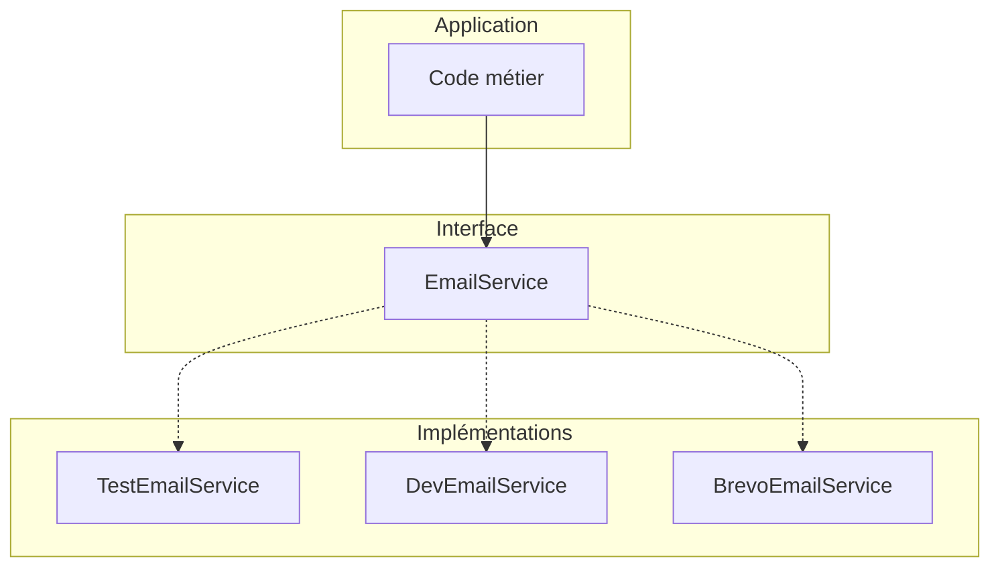

<!-- jump_to_middle -->

# Introduction

<!-- end_slide -->

Où en sommes-nous ?
====================

Dans la présentation précédente, nous avons vu :

<!-- incremental_lists: true -->

- **Classes** : le moule pour créer des objets
- **Instances** : les objets créés à partir d'une classe
- **Héritage** : spécialiser une classe avec `extends`
- **Encapsulation** : contrôler l'accès avec `private`, `public`, `protected`

<!-- incremental_lists: false -->

<!-- pause -->

Aujourd'hui, on passe à la pratique web :

<!-- incremental_lists: true -->

- **Interfaces** : définir des contrats (avec des exemples concrets du web)
- **Méthodes et attributs statiques** : comprendre `static` avec les classes d'erreur
- **Patterns dans les frameworks** : comment la POO s'utilise dans Rails, NestJS, etc.

<!-- incremental_lists: false -->

<!-- end_slide -->

<!-- jump_to_middle -->

# Interfaces

<!-- end_slide -->

Les interfaces : définir un contrat
====================================

Une **interface** décrit ce qu'un objet **sait faire**, sans dire **comment**.

```typescript
interface EmailService {
  send(to: string, subject: string, body: string): Promise<void>
}
```

<!-- pause -->

Une interface = une liste de méthodes et/ou attributs qu'une classe **doit** avoir.

C'est un **contrat** : si tu dis que tu implémentes `EmailService`, tu dois avoir une méthode `send`.

<!-- pause -->

L'interface ne dit **pas** :
- Comment l'email est envoyé
- Quel provider est utilisé

On peut avoir **plusieurs implémentations** selon le contexte :

- **En test** : `TestEmailService` qui stocke les emails en mémoire (vérifiable dans les tests)
- **En développement** : serveur SMTP local (Nodemailer, Mailhog) pour voir le rendu
- **En production** : Brevo, SendGrid, Resend...

<!-- end_slide -->

Implémenter une interface
==========================

<!-- column_layout: [1, 1] -->

<!-- column: 0 -->

```typescript
class BrevoEmailService implements EmailService {
  constructor(private apiKey: string) {}

  async send(to: string, subject: string, body: string): Promise<void> {
    await fetch("https://api.brevo.com/v3/smtp/email", {
      method: "POST",
      headers: { "api-key": this.apiKey },
      body: JSON.stringify({ to, subject, htmlContent: body })
    })
  }
}
```

<!-- column: 1 -->

```typescript
class TestEmailService implements EmailService {
  // les tests peuvent lire ce tableau pour vérifier les informations de l'email
  sentEmails: { to: string; subject: string, body: string }[] = []

  async send(to: string, subject: string, body: string): Promise<void> {
    this.sentEmails.push({ to, subject, body })
  }
}
```

<!-- reset_layout -->

<!-- pause -->

- `implements EmailService` → la classe **s'engage** à respecter le contrat, TypeScript vérifie
- `BrevoEmailService` a besoin d'une clé API → initialisée dans le constructeur
- `TestEmailService` garde un historique → le test peut vérifier que l'email a été "envoyé"

<!-- end_slide -->


L'intérêt : le code métier ne change pas
=========================================

<!-- pause -->

On définit **une seule fois** quel service utiliser, au démarrage :

```typescript
// config/email.ts
function getEmailService(): EmailService {
  if (process.env.NODE_ENV === "test") return new TestEmailService()
  if (process.env.NODE_ENV === "development") return new DevEmailService()
  return new BrevoEmailService(process.env.BREVO_API_KEY)
}

export const emailService = getEmailService()
```

<!-- pause -->

Ensuite, dans le code :

```typescript
async function notifierUtilisateurs(users: User[], emailService: EmailService) {
  for (const user of users) {
    await emailService.send(user.email, "Notification", "...")
  }
}
```

C'est un exemple de **polymorphisme** (plusieurs formes): un même code qui fonctionne avec des objets de **types différents**. `EmailService` peut faire référence à `BrevoEmailService` ou `TestEmailService`, et `notifierUtilisateurs` s'en fiche, ce n'est pas son problème.

<!-- end_slide -->

Le pattern Adapter
===================

Ce qu'on vient de voir s'appelle le pattern **Adapter** :

<!-- column_layout: [1, 1] -->

<!-- column: 0 -->



<!-- column: 1 -->

**Avantages :**

- **Découplage** : la logique métier ne dépend pas d'un projet externe, on peut changer facilement
- **Testabilité** : on remplace un mock facilement
- **Flexibilité** : on peut utiliser différentes implémentations selon le contexte – l'environnement, ou au sein d'un même environnement d'un cas d'usage à un autre

<!-- reset_layout -->

<!-- pause -->

> Ce pattern est au cœur de l'**architecture hexagonale**. L'idée : le code métier est au centre, les services externes sont des "adaptateurs" interchangeables.

Autres cas d'usage communs :

- notifications (SMS + Push)
- paiements (Stripe + Paypal)
- LLMs (Claude, ChatGPT, Gemini)
- sauvegarde (en mémoire, dans des fichiers ou en BDD)
- logs (en console, ou sauvegardés dans un fichier)

<!-- end_slide -->

Deux formes de polymorphisme
=============================

<!-- column_layout: [1, 1] -->

<!-- column: 0 -->

**Via les interfaces (`implements`)**

```typescript
interface EmailService { ... }
class BrevoEmailService implements EmailService { ... }
class TestEmailService implements EmailService { ... }

function confirmEmail(service: EmailService) {
  // Fonctionne avec n'importe quelle
  // implémentation de EmailService
}
```

Relation **"sait faire"** : `BrevoEmailService` *sait* envoyer des emails

**Utiliser `implements` quand :**

- **Comportement** partagé sans lien de parenté
- On veut pouvoir **changer d'implémentation**
- On veut pouvoir implémenter plusieurs interfaces

<!-- column: 1 -->

**Via l'héritage (`extends`)**

```typescript
class NotFoundError extends Error { ... }
class ValidationError extends Error { ... }

function handleError(error: Error) {
  // Fonctionne avec Error, NotFoundError, ValidationError, ou tout enfant d'Error
}
```

Relation **"est un"** : `NotFoundError` *est une* `Error`

**Utiliser `extends` quand :**
- La classe enfant **est une version spécialisée** du parent
- On veut **partager du code** entre classes
- La classe enfant n'a pas besoin d'`extend` une autre classe

<!-- reset_layout -->

<!-- pause -->

> TypeScript permet le polymorphisme car, par exemple, le code dans `confirmEmail` n'aura accès que aux attributs et aux méthodes définies sur l'interface `EmailService`.

<!-- end_slide -->

<!-- jump_to_middle -->

# 🛠️ Exercice : Logger

<!-- end_slide -->

Exercice — Logger
==================

Il est fréquent de vouloir un comportement différent par environnement pour les logs.

- **En développement** : on veut voir les logs en console pour débugger
- **En test** : on veut que les logs soient silencieux pour ne pas polluer la sortie
- **En production** : on écrit dans des fichiers, lus par des outils de monitoring (Datadog, etc.)

<!-- pause -->

**Étape 1 — Définir l'interface**

```typescript
interface LoggerTransport {
  log(message: string): void
}
```

<!-- pause -->

**Étape 2 — Implémenter les classes** (avec `implements LoggerTransport`)

- `ConsoleLogger` : affiche les messages dans la console (comportement normal)
- `SilentLogger` : stocke les messages en mémoire (pour les tests) dans un attribut `logHistory`
- Bonus: `FileLogger` : écrit dans un fichier (utilisez `fs.appendFileSync`)

**Exemple d'utilisation**

```typescript
export const logger = process.env.NODE_ENV === 'test' ? new SilentLogger() : new ConsoleLogger()

// ailleurs dans le code, à la place de console.log
logger.log("Ce log sera silencieux dans les tests")
```

<!-- end_slide -->

<!-- jump_to_middle -->

# Méthodes et attributs statiques

<!-- end_slide -->

Attributs statiques vs attributs d'instance
=============================================

Une classe peut définir des **attributs statiques** : ils appartiennent à la classe, pas à l'instance. Utile pour des constantes de configuration.

```typescript
class StripeClient {
  static readonly BASE_URL = "https://api.stripe.com/v1"

  constructor(readonly apiKey: string) {}

  async fetch<T>(path: string): Promise<T> {
    const response = await fetch(StripeClient.BASE_URL + path, {
      headers: { Authorization: `Bearer ${this.apiKey}` },
    })
    return response.json()
  }
}

StripeClient.BASE_URL // pas besoin de new
const client = new StripeClient("sk-dken...")
client.apiKey // accessible sur l'instance
```

<!-- end_slide -->

Méthodes statiques vs méthodes d'instance
==========================================

De la même manière, une classe peut définir des méthodes statiques. Le cas d'usage le plus courant est pour créer des manières alternatives de créer un objet, notamment en async.

```typescript
class Todo {
  // pour empêcher l'utilisation de new, on peut utiliser "private"
  private constructor(public id: string, public title: string, public done: boolean) {}

  static async create(title: string): Promise<Todo> {
    const todo = await db.insert(todos).values({ title, done: false }).returning()
    return new Todo(todo.id, todo.title, todo.done)
  }

  static async findById(id: string): Promise<Todo> {
    const todo = await db.todos.findFirst({ where: eq(todos.id, id) })
    return new Todo(todo.id, todo.title, todo.done)
  }
}

// pour créer d'un coup en BDD + récupérer une instance
const todo = await Todo.create("Aller chez le dentiste")

// pour récupérer et instancier un todo existant
const todo = await Todo.findById("abc123")
```

<!-- end_slide -->

<!-- jump_to_middle -->

# 🛠️ Exercice : HttpError

<!-- end_slide -->

Pourquoi créer des classes d'erreur custom ?
=============================================

Dans une application, on a souvent **plusieurs types d'erreurs** avec des besoins différents :

- **Erreur de validation** → renvoyer les champs invalides et l'erreur par champ
- **Erreur inattendue** → logger les détails techniques, cacher le message au client
- **Erreur resource introuvable**
- **Erreur d'authentification ou d'authorisation**

<!-- pause -->

Avec des classes custom, on peut :

- **Classifier**, modéliser, documenter les types d'erreurs
- **Facilement les identifier** (via `instanceof`) quand on les "attrape"
- **Attacher des données** spécifiques (statusCode, fields, etc.)

<!-- end_slide -->

Centraliser la gestion des erreurs
===================================

Dans Express ou Next.js, on peut créer un **error handler** qui attrape toutes les erreurs et les formate selon leur type :

```typescript
app.use((err, req, res, next) => {
  if (err instanceof NotFoundError) {
    res.status(404).json({ code: NotFoundError.CODE, error: err.message })
  } else if (err instanceof AuthenticationError) {
    res.status(401).json({ code: AuthenticationError.CODE, error: err.message })
  } else if (err instanceof AuthorizationError) {
    res.status(403).json({ code: AuthorizationError.CODE, error: err.message })
  } else if (err instanceof ValidationError) {
    res.status(400).json({ code: ValidationError.CODE, error: err.message, fields: err.fields })
  } else {
    console.error("ERREUR INATTENDUE", err)  // Log les détails techniques
    res.status(500).json({ code: "SERVER_ERROR", error: "Erreur inconnue" })
  }
})
```

<!-- end_slide -->

Exercice — HttpError
=====================

Créez une classe `HttpError` pour gérer les erreurs HTTP dans une API.

**Étape 1 — Classe de base**

- Créer une classe `HttpError` qui étend `Error`
- Attributs d'instance : `statusCode: number`, `meta?: Record<string, unknown>`
- Le constructeur prend `statusCode`, `message`, `machineCode`, et `meta` (optionnel)

<!-- pause -->

**Étape 2 — Factory methods statiques**

Créer des méthodes statiques pour les erreurs courantes :

- `HttpError.notFound(message)` → retourne `new HttpError(404, message, "NOT_FOUND", meta)`
- `HttpError.badRequest(message, meta?)`
- `HttpError.validationError(fields: Record<string, string>)` -> new HttpError(400, "Des champs sont invalides", "BAD_REQUEST", fields)
- `HttpError.unauthorized(message, meta?)`

<!-- pause -->

L'avantage : `throw HttpError.notFound()` est plus simple que
`throw new HttpError(404, "User not found")`.

<!-- pause -->

**Étape 4 — Utilisation**

```typescript
// Lancer une erreur
throw HttpError.notFound("Utilisateur non trouvé")

// Avec des métadonnées
throw HttpError.badRequest("Validation échouée", { fields: ["email", "name"] })
```

<!-- end_slide -->

Exercice — HttpError (middleware)
==================================

**Étape 5 — Middleware Express**

```typescript
app.use((err, req, res, next) => {
  if (err instanceof HttpError) {
    res.status(err.statusCode).json({ error: err.message, ...err.meta })
  } else {
    next(err)
  }
})
```

<!-- pause -->

Exemple complet d'utilisation dans un handler :

```typescript
app.get("/users/:id", async (req, res) => {
  const user = await db.findUser(req.params.id)
  if (!user) {
    throw HttpError.notFound("Utilisateur non trouvé")
  }
  res.json(user)
})
```

<!-- end_slide -->

<!-- jump_to_middle -->

# La POO dans les frameworks web

<!-- end_slide -->

Comment la POO est utilisée dans le web ?
==========================================

Selon les langages et frameworks, la POO est plus ou moins présente :

<!-- column_layout: [1, 1] -->

<!-- column: 0 -->

**100% orienté objet**

- Ruby on Rails
- Laravel (PHP)
- NestJS (TypeScript)
- Spring (Java)

Tout est classe : modèles, contrôleurs, services...

<!-- column: 1 -->

**Plus fonctionnel**

- Express.js (fonctions)
- Next.js (fonctions)
- Drizzle ORM (fonctions)

Moins de classes, plus de fonctions pures.

<!-- reset_layout -->

<!-- pause -->

Même si vous codez principalement avec des fonctions, comprendre ces patterns est important :
- Vous lirez du code qui les utilise
- Certains projets/équipes les imposent
- D'autres langages (PHP, Ruby, Java) les utilisent partout

<!-- end_slide -->

Le pattern Active Record
=========================

Très utilisé dans Rails, Laravel, TypeORM...

```typescript
class User extends Model {
  name: string
  email: string
  emailConfirmed: boolean = false

  confirmEmail() {
    this.emailConfirmed = true
    this.save()  // save() vient de Model
  }
}
```

<!-- pause -->

Utilisation :

```typescript
// Trouver un utilisateur (méthode statique héritée)
const user = await User.findById(123)

// Modifier et sauvegarder
user.confirmEmail()  // Modifie l'objet ET persiste en BDD
```

<!-- pause -->

`save()` et `findById()` sont définis dans la classe parent `Model`, pas dans `User`. C'est l'héritage en action.

<!-- end_slide -->

Active Record : avantages et inconvénients
===========================================

<!-- column_layout: [1, 1] -->

<!-- column: 0 -->

**Avantages**

- Intuitif : `user.save()` parle de lui-même
- Tout au même endroit : données + comportements
- Rapide à écrire pour des cas simples

<!-- column: 1 -->

**Inconvénients**

- Fichiers énormes quand le modèle grossit
- Mélange persistance et logique métier
- Difficile à tester en isolation

<!-- reset_layout -->

<!-- pause -->

**Le problème des "god models" :**

```typescript
class User extends Model {
  // Attributs
  // Validations
  // Relations
  // Callbacks
  // Méthodes métier
  // Queries complexes
  // ... 500 lignes plus tard
}
```

<!-- pause -->

Solution : le pattern **Repository** qui sépare la logique de persistance.

<!-- end_slide -->

Le pattern Repository
======================

Sépare la logique métier de la persistance :

```typescript
// L'entité : juste les données et la logique métier
class User {
  name: string
  email: string
  emailConfirmed: boolean = false

  confirmEmail() {
    this.emailConfirmed = true
    // Pas de save() ici !
  }
}

// Le repository : gère la persistance
class UserRepository {
  async findById(id: number): Promise<User | null> {
    // Requête SQL...
  }

  async save(user: User): Promise<void> {
    // INSERT ou UPDATE...
  }
}
```

<!-- pause -->

Utilisation :

```typescript
const repo = new UserRepository()
const user = await repo.findById(123)
user.confirmEmail()
await repo.save(user)
```

<!-- end_slide -->

Contrôleurs avec héritage
==========================

Dans beaucoup de frameworks, les contrôleurs héritent d'une classe de base :

```typescript
class UserController extends BaseController {
  // BaseController fournit : this.params, this.currentUser, etc.

  show() {
    const user = User.findById(this.params.id)
    return this.json(user)
  }

  create() {
    const data = this.body
    if (!this.currentUser.isAdmin) {
      throw new ForbiddenError()
    }
    // ...
  }
}
```

<!-- pause -->

`BaseController` injecte des fonctionnalités communes :
- Accès aux paramètres de la requête
- Utilisateur courant (authentification)
- Méthodes helper (`json()`, `redirect()`, etc.)

C'est l'héritage qui permet cette "magie".

<!-- end_slide -->

NestJS : un framework 100% POO
===============================

NestJS utilise massivement les classes et les décorateurs :

```typescript
@Controller('users')
class UserController {
  constructor(private userService: UserService) {}

  @Get(':id')
  async getUser(@Param('id') id: string) {
    return this.userService.findById(id)
  }

  @Post()
  async createUser(@Body() data: CreateUserDto) {
    return this.userService.create(data)
  }
}
```

<!-- pause -->

- `@Controller`, `@Get`, `@Post` : décorateurs (métadonnées sur les classes)
- `UserService` injecté via le constructeur (injection de dépendances)
- Structure très similaire à Spring (Java) ou ASP.NET (C#)

<!-- end_slide -->

L'approche fonctionnelle : pas de classes
==========================================

En JS/TS moderne, beaucoup de projets n'utilisent pas de classes :

```typescript
// Avec Drizzle ORM — pas de classes
const users = await db.select().from(usersTable).where(eq(usersTable.id, 123))

// Avec Next.js Server Actions — fonctions
export async function createUser(formData: FormData) {
  const name = formData.get("name")
  await db.insert(usersTable).values({ name })
}
```

<!-- pause -->

Avantages de l'approche fonctionnelle :
- Plus simple pour des cas simples
- Moins de "magie" (pas d'héritage, pas de `this`)
- Facile à tester (entrée → sortie)

<!-- pause -->

L'approche "tout fonctions" est populaire en JS, mais moins en PHP, Ruby, Java où la POO est la norme.

<!-- end_slide -->

<!-- jump_to_middle -->

# Conclusion

<!-- end_slide -->

Ce qu'il faut retenir
======================

<!-- incremental_lists: true -->

- **Interfaces** : définir des contrats pour le polymorphisme
  - Pattern Adapter : une interface, plusieurs implémentations
  - Permet de changer de provider facilement (emails, paiements, etc.)

- **Méthodes/attributs statiques** : appartiennent à la classe, pas aux instances
  - Utiles pour les constantes (`ERROR_CODE`) et les factory methods
  - Centralise les valeurs pour éviter les copier-coller

- **Patterns des frameworks** :
  - Active Record : modèle = données + persistance
  - Repository : sépare données et persistance
  - Contrôleurs : héritage pour partager des helpers

<!-- incremental_lists: false -->

<!-- end_slide -->

La POO n'est pas obligatoire... mais importante
================================================

En JavaScript/TypeScript moderne :
- Beaucoup de projets utilisent des fonctions pures
- React, Next.js, Drizzle sont plutôt "fonctionnels"

<!-- pause -->

Mais la POO reste **incontournable** :
- **PHP** (Laravel, Symfony) : tout est classe
- **Ruby** (Rails) : tout est objet
- **Java** (Spring) : POO pure
- **C#** (ASP.NET) : POO pure

<!-- pause -->

**L'objectif de ces cours :**

Comprendre la POO **en général**, pas spécifiquement en JS. Les concepts (héritage, interfaces, encapsulation, polymorphisme) se transposent à tous ces langages.

Même si vous codez en fonctionnel au quotidien, vous **lirez** du code orienté objet — et maintenant vous le comprendrez.

<!-- end_slide -->
