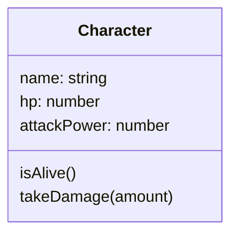
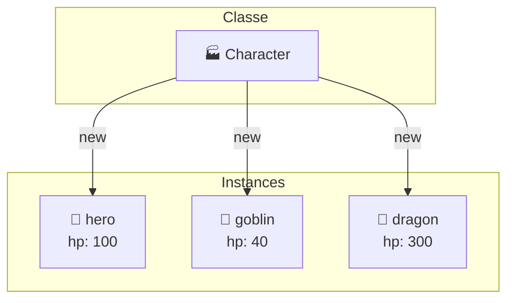
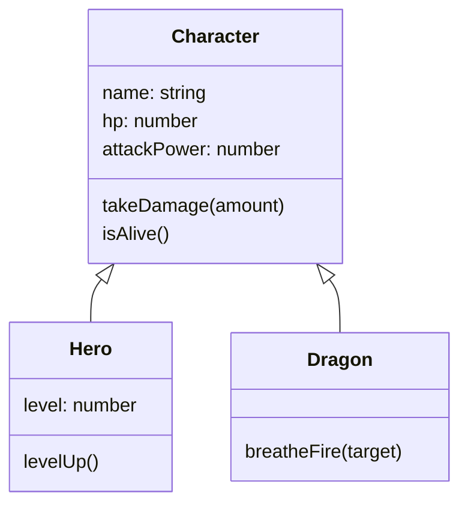

<!-- jump_to_middle -->

# Pourquoi la POO ?

<!-- end_slide -->

La Programmation Orientée Objet, c'est quoi ?
===============================================

Un **paradigme de programmation** qui modélise le code avec des **familles d'objets** — chacune ayant des **attributs** (données) et des **méthodes** (comportements).

<!-- pause -->

Peut être utilisé partout : jeux vidéo, applications desktop / mobile / web, scripts, outils système, simulations...

> Pas besoin de base de données (pour le moment) — on modélise directement dans le code.

<!-- pause -->

Exemples :

<!-- column_layout: [1, 1] -->

<!-- column: 0 -->

**Un client (app bancaire)**
- *Attributs :* `nom`, `email`, `solde`
- *Méthodes :* `deposer(montant)`, `retirer(montant)`

**Une voiture (simulation)**
- *Attributs :* `vitesse`, `carburant`, `position`
- *Méthodes :* `accelerer()`, `freiner()`

<!-- column: 1 -->

**Un deck (jeu de poker)**
- *Attributs :* `cartes`, `pioche`, `defausse`
- *Méthodes :* `melanger()`, `tirer()`

**Une tâche (to-do app)**
- *Attributs :* `titre`, `statut`, `priorite`
- *Méthodes :* `marquerFaite()`, `changerPriorite(p)`

<!-- reset_layout -->

<!-- end_slide -->

<!-- jump_to_middle -->

# Classes, instances, constructeurs

<!-- end_slide -->

La classe : un **moule**
=========================

Un moule à gaufres définit la **forme**. Chaque gaufre produite est une **instance** distincte — même forme, mais la pâte peut être différente.

La classe, c'est le moule. L'objet, c'est la gaufre.

<!-- pause -->

Exemple d'un personnage de jeu vidéo :

<!-- column_layout: [1, 1] -->

<!-- column: 0 -->



<!-- column: 1 -->

```typescript +line_numbers
class Character {
  name: string
  hp: number
  attackPower: number

  constructor(name: string, hp: number, attackPower: number) {
    this.name = name
    this.hp = hp
    this.attackPower = attackPower
  }

  isAlive(): boolean {
    return this.hp > 0
  }

  takeDamage(amount: number): void {
    this.hp -= amount
  }
}
```

<!-- reset_layout -->

<!-- end_slide -->

Instancier une classe
======================

<!-- column_layout: [1, 1] -->

<!-- column: 0 -->

```typescript
const hero = new Character("Alix", 100, 15)
const goblin = new Character("Goblin", 40, 8)
const dragon = new Character("Dragon", 300, 50)
```

`new` appelle le **constructeur** et crée une instance en mémoire.

```typescript
console.log(hero.name)      // "Alix"
console.log(goblin.isAlive()) // true

goblin.takeDamage(50)
console.log(goblin.isAlive()) // false
```

Chaque instance a son **propre état**.

<!-- column: 1 -->



<!-- reset_layout -->

<!-- end_slide -->

C'est quoi `this` ?
====================

```typescript
class Character {
  name: string

  constructor(name: string) {
    this.name = name  // ← "this" = l'instance en cours de création
  }

  greet(): string {
    return `Je m'appelle ${this.name}` // ← "this" = l'instance qui appelle la méthode
  }
}

const hero = new Character("Alix")
hero.greet() // "Je m'appelle Alix"
```

<!-- pause -->

`this` est une référence à **l'instance elle-même**.

Quand `hero.greet()` s'exécute, `this` pointe vers `hero`.
Quand `goblin.greet()` s'exécute, `this` pointe vers `goblin`.

<!-- end_slide -->

Vocabulaire à retenir
======================

<!-- incremental_lists: true -->

- **Classe** → le moule, le plan de construction (`Character`)
- **Instance** → un objet créé à partir de la classe (`hero`, `goblin`)
- **Attribut** → une donnée de l'objet (`name`, `hp`)
- **Méthode** → une fonction de l'objet (`isAlive()`, `takeDamage()`)
- **Constructeur** → la méthode appelée par `new` pour initialiser l'instance
- **`this`** → référence à l'instance courante

<!-- incremental_lists: false -->

<!-- pause -->

> Une instance, c'est un objet. Et la plupart du temps quand on parle en langage POO, si on parle d'un objet on parle d'une instance.

<!-- end_slide -->

Pourquoi définir des méthodes ?
================================

<!-- column_layout: [1, 1] -->

<!-- column: 0 -->

```typescript
class Character {
  name: string
  hp: number

  constructor(name: string, hp: number) {
    this.name = name
    this.hp = hp
  }

  takeDamage(amount: number): void {
    this.hp = Math.max(0, this.hp - amount)
  }

  isAlive(): boolean {
    return this.hp > 0
  }
}
```

<!-- column: 1 -->

On pourrait écrire :

```typescript
hero.hp = hero.hp - 30
if (hero.hp > 0) { ... }
```

Mais on préfère :

```typescript
hero.takeDamage(30)
if (hero.isAlive()) { ... }
```

<!-- reset_layout -->

<!-- pause -->

**Pourquoi ?**

<!-- incremental_lists: true -->

- **Lisibilité** : le code client est plus clair. `hero.takeDamage(30)` se lit instantanément. `hero.hp = hero.hp - 30` demande un effort d'interprétation.
- **Documentation vivante** : en lisant la classe, on voit les données ET les fonctions qui les modifient. On comprend d'un coup d'œil comment interagir avec l'objet.
- **Logique centralisée** : si les règles changent (HP minimum à 0, armure, etc.), on modifie un seul endroit.

<!-- incremental_lists: false -->

<!-- end_slide -->

<!-- jump_to_middle -->

# 🛠️ Exercice 1

<!-- end_slide -->

Exercice 1 — Application de location de films
===============================================

Nous allons modéliser une application de location de films.

<!-- pause -->

**Étape 1 — Créer les classes**

Créez les classes `Film` et `Realisatrice` avec leurs attributs.
- Les **films** ont un titre, une date de sortie, ainsi qu'une réalisatrice.
- Les **réalisatrices** ont un nom, un prénom et une année de naissance.

**Étape 2 — Fonction d'affichage**

Écrivez une méthode `presenter()` sur un `Film` qui affiche (logge) :

> "Le film Anatomie d'une chute est sorti en 2023 et est réalisé par Justine Triet"

Instanciez 3 films avec leurs réalisatrices et testez votre fonction.

**Étape 3 — Clients**

Créez une classe `Client` avec nom, prénom, et une liste de films en location.
Ajoutez une méthode `louerFilm(film: Film)` qui ajoute à la liste.

<!-- end_slide -->

<!-- jump_to_middle -->

# Héritage et spécialisation

<!-- end_slide -->

Le problème : des classes trop similaires
==========================================

On veut modéliser un héros et un dragon. Tous deux ont un nom, des HP, de l'attaque...

```typescript
class Hero {
  name: string; hp: number; attackPower: number
  takeDamage(amount: number) { ... }
  isAlive() { ... }
  levelUp() { ... }  // spécifique au héros
}

class Dragon {
  name: string; hp: number; attackPower: number
  takeDamage(amount: number) { ... }  // code identique
  isAlive() { ... }                   // code identique
  breatheFire(target) { ... }         // spécifique au dragon
}
```

<!-- pause -->

`takeDamage` et `isAlive` sont **copiés-collés**. Si on corrige un bug dans l'un, il faut penser à l'autre.

<!-- end_slide -->

L'héritage : factoriser le commun
====================================

Comme les espèces animales : un chien et un chat **respirent, mangent, vieillissent** (comportements communs). Mais chacun a ses spécificités. On ne réinvente pas "respirer" pour chaque espèce.

Ici, c'est pareil : on peut garder notre classe personnage (`Character`) avec les attributs et comportements communs, et en "hériter" dans différents types de personnages.



<!-- end_slide -->

On hérite avec `extends`
==========================

```typescript +line_numbers
class Hero extends Character {
  level: number

  constructor(name: string) {
    super(name, 100, 15)  // appelle le constructeur de Character
    this.level = 1
  }

  levelUp(): void {
    this.level++
    this.attackPower += 5
    console.log(`${this.name} passe au niveau ${this.level} !`)
  }
}

class Dragon extends Character {
  constructor() {
    super("Dragon", 300, 50)
  }

  breatheFire(target: Character): void {
    target.takeDamage(this.attackPower * 2)
  }
}
```

<!-- end_slide -->

Ce qu'on hérite
================

```typescript
const hero = new Hero("Alix")

hero.takeDamage(30)   // ✅ hérité de Character
hero.isAlive()        // ✅ hérité de Character
hero.levelUp()        // ✅ défini dans Hero

const dragon = new Dragon()
dragon.takeDamage(10) // ✅ hérité de Character
dragon.breatheFire(hero) // ✅ défini dans Dragon
```

<!-- pause -->

`Hero` et `Dragon` ont tout ce que `Character` propose, **plus** ce qu'ils définissent eux-mêmes.

<!-- pause -->

`super(...)` dans le constructeur enfant → appelle le constructeur parent. **Obligatoire** si la classe parent a un constructeur.

<!-- end_slide -->

Surcharger une méthode : `override`
=====================================

Un enfant peut **remplacer** le comportement d'une méthode héritée avec `override` et `super`.

```typescript
class Boss extends Character {
  constructor() {
    super("Boss Final", 1000, 80)
  }

  // Le boss a un comportement différent quand il prend des dégâts
  override takeDamage(amount: number): void {
    const reduced = Math.floor(amount * 0.5)  // résistance aux dégâts
    super.takeDamage(reduced)                  // on appelle quand même le parent
  }
}
```

<!-- pause -->

`super.takeDamage(reduced)` → appelle la version **parent** de la méthode.

<!-- end_slide -->

Classes abstraites
===================

Parfois, une classe parent n'a pas vocation à être instanciée directement. On ne crée jamais un `Character` générique — on crée toujours un `Hero`, un `Dragon`, un `Boss`...

```typescript
abstract class Character {
  name: string
  hp: number

  constructor(name: string, hp: number) {
    this.name = name
    this.hp = hp
  }

  takeDamage(amount: number): void {
    this.hp -= amount
  }

  // Méthode abstraite : pas d'implémentation ici
  // Les enfants DOIVENT la définir
  abstract attaquer(cible: Character): void
}
```

<!-- pause -->

- `abstract class` → impossible de faire `new Character(...)`
- `abstract attaquer(...)` → chaque enfant doit fournir sa propre implémentation

<!-- end_slide -->

Implémenter une méthode abstraite
==================================

```typescript
class Hero extends Character {
  attaquer(cible: Character): void {
    console.log(`${this.name} frappe avec son épée !`)
    cible.takeDamage(20)
  }
}

class Dragon extends Character {
  attaquer(cible: Character): void {
    console.log(`${this.name} crache du feu !`)
    cible.takeDamage(50)
  }
}
```

<!-- pause -->

Le parent définit **ce qui doit exister**. Les enfants définissent **comment**.

> Si tu oublies d'implémenter `attaquer()` dans une classe enfant, TypeScript te donnera une erreur.

<!-- end_slide -->

<!-- jump_to_middle -->

# 🛠️ Exercice 2

<!-- end_slide -->

Exercice 2 — Flotte spatiale
=============================

Nous allons modéliser une flotte de vaisseaux spatiaux.

Voici les données à représenter :

| Nom | Type | Taille (m) | Canons | Capacité (personnes) |
|-----|------|------------|--------|-------------------|
| Acclamator | Croiseur | 752 | — | 700 |
| Corvette CR90 | Croiseur | 150 | — | 165 |
| X-wing | Intercepteur | 12.5 | 2 | — |
| Y-wing | Intercepteur | 23 | 2 | — |

<!-- pause -->

Crée 3 classes avec de l'héritage :

- `Vaisseau` (classe abstraite):
  - attributs `nom`, `type` et `taille`
  - la méthode `afficherCaracteristiques()` qui affiche le nom, le type et la taille
- `Croiseur` qui hérite de `Vaisseau`
  - ajoute les attributs `capacité` et `personnesABord`
  - la méthode `charger(nombre: number)` qui ajoute des personnes (sans dépasser la capacité)
  - la méthode `décharger(nombre)` qui fait l'inverse.
- `Intercepteur` hérite de `Vaisseau`
  - ajoute les attributs `canons`, un `nombreDeTirs` initialisé à 0
  - une méthode `tirer()` qui logge "Tire !" et ne fonctionne que si `nombreDeTirs < canons` (sinon affiche "Plus de munitions");
  - une méthode `recharger()` qui logge "Recharge !" et réinitialise `nombreDeTirs`.

> N'oublie pas : le constructeur de chaque classe enfant doit appeler `super(...)` pour initialiser le parent

<!-- end_slide -->

Tester votre code
===================

<!-- pause -->

1. Instancie **deux Acclamator** et **un X-wing**

2. Sur un Acclamator :
   - Charge 600 hommes → doit fonctionner
   - Charge 200 hommes de plus → doit échouer (capacité max : 700)

<!-- pause -->

3. Sur le X-wing (2 canons) :
   - Tire 3 fois → les 2 premiers coups fonctionnent, le 3ème échoue
   - Recharge
   - Tire à nouveau → doit fonctionner

<!-- end_slide -->

<!-- jump_to_middle -->

# JavaScript, TypeScript et la POO

<!-- end_slide -->

JavaScript est-il orienté objet ?
==================================

**Réponse courte : pas vraiment, ou pas au sens classique.**

JavaScript est **multi-paradigme** : on peut coder en impératif, fonctionnel, ou orienté objet. Le langage ne t'oblige à rien.

<!-- pause -->

Ce qui distingue JS des langages "vraiment" OO (Ruby, Java, C#) :

- Le mot-clé `class` est un peu décoratif — il n'existe pas de "vraies" classes en JS
- `typeof monObjet` retourne `"object"`, pas le nom de la classe
- Pour tester si un objet est une instance, il faut utiliser `instanceof`

```typescript
const hero = new Character("Alix", 100)
typeof hero          // "object"
hero instanceof Character  // true
```

<!-- pause -->

Cependant, les principales fonctionnalités qui permettent de développer en orienté objet ont été implémentées en JavaScript/TypeScript et il est courant de voir des projets JavaScript utilisant de la POO, au moins à certains endroits.

<!-- pause -->

> JavaScript utilise un système de **prototypes** pour simuler l'orienté objet. C'est un sujet avancé. Si tu veux approfondir, cherche "JavaScript prototypes". Pour l'instant, retiens juste que `class` en JS est une façade qui cache ce mécanisme.

<!-- end_slide -->

Et TypeScript dans tout ça ?
=============================

TypeScript **compile vers JavaScript**. Tout ce qu'il ajoute disparaît à l'exécution.

Mais pendant le développement, TypeScript apporte des outils pour mieux structurer ton code orienté objet :

<!-- incremental_lists: true -->

- Vérification des types à la compilation
- `private`, `protected`, `public`, `readonly`
- Getters et setters
- `interface` et `implements`

<!-- incremental_lists: false -->

<!-- pause -->

> TypeScript t'aide à **penser** en orienté objet et à éviter les erreurs, même si le JS produit n'a pas ces protections.

<!-- end_slide -->

<!-- jump_to_middle -->

# Encapsulation avec TypeScript

<!-- end_slide -->

`private`, `public`, `protected`
==================================

```typescript
class Character {
  public name: string        // accessible partout (par défaut)
  private hp: number         // accessible uniquement dans cette classe
  protected attackPower: number  // accessible dans cette classe ET ses enfants
}
```

<!-- pause -->

En pratique :

<!-- incremental_lists: true -->

- `public` → ce qu'on expose à l'extérieur
- `private` → les données internes qu'on protège
- `protected` → accessible aux classes enfants (utile avec l'héritage)

<!-- incremental_lists: false -->

<!-- pause -->

> Ces mots-clés disparaissent à la compilation. En JS, tout redevient accessible. Mais TypeScript t'empêche de tricher pendant le développement.

<!-- end_slide -->

`readonly` : empêcher la modification
======================================

```typescript
class Character {
  readonly name: string

  constructor(name: string) {
    this.name = name  // ✅ OK dans le constructeur
  }

  changeName(newName: string) {
    hero.name = newName // ❌ Erreur : name est readonly
  }
}
```

<!-- pause -->

`readonly` = assignable une seule fois, dans le constructeur. Après, c'est figé.

Utile pour les identifiants, les configurations, tout ce qui ne doit pas changer.

<!-- end_slide -->

Getters et setters
===================

Parfois, on veut qu'un attribut soit visible à l'extérieur mais modifiable que dans la classe. Dans ce cas il nous faudra combiner `private` + un "getter"

Un **getter** permet de lire une valeur calculée comme si c'était un attribut.

```typescript
class Character {
  private _hp: number
  private maxHp: number

  get hp(): number {
    return this._hp
  }

  get hpPercent(): number {
    return (this._hp / this.maxHp) * 100
  }
}

console.log(hero.hp)        // 80
console.log(hero.hpPercent) // 80 (si maxHp = 100)
```

<!-- end_slide -->

Setters : contrôler les modifications
======================================

Un **setter** permet de contrôler comment une valeur est modifiée.

```typescript
class Character {
  private _hp: number

  set hp(value: number) {
    if (value < 0) {
      this._hp = 0
    } else {
      this._hp = value
    }
  }
}

hero.hp = -50  // en réalité, _hp sera mis à 0
```

<!-- pause -->

> Les getters/setters permettent d'exposer des "propriétés" tout en gardant le contrôle sur la lecture et l'écriture.

<!-- end_slide -->

Analogie de l'encapsulation : la boîte noire
==========================

Un distributeur de billets :

<!-- incremental_lists: true -->

- Vous savez **ce qu'il fait** : retirer de l'argent, vérifier le solde
- Vous ne savez pas **comment** il le fait en interne
- Vous ne pouvez pas modifier directement le solde de la banque
- Tout passe par une **interface définie** (l'écran, les boutons)

<!-- incremental_lists: false -->

<!-- pause -->

C'est exactement ça, l'encapsulation.

L'objet expose des **méthodes publiques** bien définies. Son état interne est protégé.

<!-- end_slide -->

<!-- jump_to_middle -->

# Interfaces

<!-- end_slide -->

Les interfaces : décrire un contrat
=====================================

## Qu'est-ce que c'est?

Dans un RPG, imaginons des objets d'inventaire très différents :
- Une **Potion** se consomme (et disparaît)
- Une **Arme** s'équipe (et reste)

Mais les deux peuvent être **achetés**.

<!-- pause -->

Ces objets n'ont pas de parent commun logique. Mais ils partagent des **comportements**. C'est là qu'interviennent les **interfaces** : elles décrivent ce qu'un objet **sait faire**, sans dire **comment**.

<!-- pause -->

## Définir des interfaces

```typescript
interface Consommable {
  consommer(cible: Character): void  // l'objet disparaît après usage
}

interface Equippable {
  equiper(personnage: Character): void  // l'objet reste équipé
}

interface Achetable {
  prix: number  // une interface peut aussi définir des attributs
}
```

<!-- pause -->

Une interface = une liste de méthodes et/ou attributs qu'une classe **doit** avoir.

C'est un **contrat** : si tu dis que tu es `Consommable`, tu dois avoir une méthode `consommer()`.

<!-- end_slide -->

Implémenter plusieurs interfaces
=================================

```typescript
class Potion implements Consommable, Achetable {
  prix: number = 25
  used: boolean = false

  consommer(cible: Character): void {
    if (!this.used) {
      cible.heal(50)
      this.used = true
    }
  }
}

class Arme implements Equippable, Achetable {
  constructor(public readonly prix: number) {}

  equiper(personnage: Character): void {
    personnage.arme = this
  }
}
```

<!-- pause -->

- `Potion` est **Consommable** et **Achetable** (mais pas Equippable)
- `Arme` est **Equippable** et **Achetable** (mais pas Consommable)

<!-- end_slide -->

L'intérêt : traiter des objets différents de la même façon
===========================================================

```typescript
class Hero extends Character {
  // ...other attributes
  protected inventaire: Achetable[] = []
  protected coins: number = 100

  public acheter(objet: Achetable) {
    if (coins < objet.price) {
      console.log("Pas assez de pièces d'or")
      return
    }
    this.inventaire.push(objet)
    this.coins -= objet.coins
    console.log(`Acheté pour ${objet.prix} pièces d'or !`)
  }
}

const hero = new Hero()
const potion = new Potion()
const epee = new Arme(50)

hero.acheter(potion)  // ✅ "Acheté pour 25 pièces d'or !"
hero.acheter(epee)    // ✅ "Acheté pour 50 pièces d'or !"
```

<!-- pause -->

La fonction accepte **n'importe quel objet** qui a un attribut `prix`.

Elle ne sait pas si c'est une Potion ou une Arme — et elle s'en fiche.

<!-- end_slide -->

<!-- jump_to_middle -->

# Polymorphisme

<!-- end_slide -->

Le polymorphisme, c'est quoi ?
===============================

**Polymorphisme** = "plusieurs formes"

Un même code qui fonctionne avec des objets de **types différents**.

<!-- pause -->

```typescript
function combattre(personnages: Character[]): void {
  for (const p of personnages) {
    p.attaquer(ennemi)  // chaque personnage attaque à sa manière
  }
}

const equipe: Character[] = [new Hero("Alix"), new Dragon()]
combattre(equipe)
// "Alix frappe avec son épée !"
// "Dragon crache du feu !"
```

<!-- pause -->

Le code de `combattre` ne sait pas si c'est un `Hero` ou un `Dragon`. Il sait juste que c'est un `Character` — et que tout `Character` sait `attaquer()`.

<!-- end_slide -->

Deux formes de polymorphisme
=============================

<!-- column_layout: [1, 1] -->

<!-- column: 0 -->

**Via l'héritage (`extends`)**

```typescript
const persos: Character[] = [
  new Hero("Alix"),
  new Dragon(),
  new Boss()
]

for (const p of persos) {
  p.takeDamage(10)
}
```

Chaque classe peut avoir un comportement différent grâce à `override`.

<!-- column: 1 -->

**Via les interfaces (`implements`)**

```typescript
const boutique: Achetable[] = [
  new Potion(),
  new Arme(150),
]

for (const item of boutique) {
  console.log(item.prix)
}
```

Des classes sans lien de parenté, unies par un contrat commun.

<!-- reset_layout -->

<!-- pause -->

Dans les deux cas : **un seul code** qui manipule **plusieurs types**. C'est ça, le polymorphisme.

<!-- end_slide -->

`extends` vs `implements`
===========================

<!-- column_layout: [1, 1] -->

<!-- column: 0 -->

**`extends`**
*héritage de classe*

```typescript
class Hero extends Character {
  // hérite du code
  // une seule classe parent
}
```

On récupère le **code** du parent.

**`extends`** quand :
- La classe enfant **est une version spécialisée** du parent: Hero *est un* Character
- On veut mettre en commun du code entre plusieurs classes
- On a pas encore de parent sur une classe (un seul possible)

<!-- column: 1 -->

**`implements`**
*implémentation d'interface*

```typescript
class Potion implements Consommable, Achetable {
  // doit tout écrire
  // plusieurs interfaces possibles
}
```

On s'engage à respecter un **contrat**.

**`implements`** quand :
- Des objets différents partagent un **comportement commun** sans relation parent/enfant naturelle: Potion et Arme sont tous deux `Achetable`
- On veut pouvoir traiter des objets de plusieurs types (mais un comportement commun) avec le même code
- On veut pouvoir avoir plusieurs comportements

<!-- reset_layout -->
