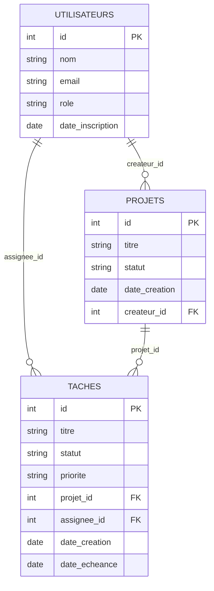
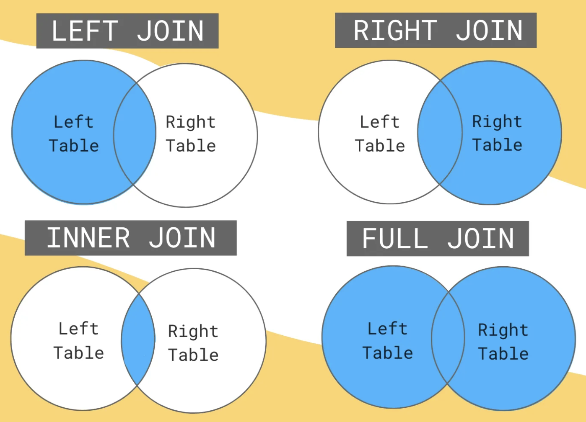

## Le jeu de données du jour

La base de données de Lovelace Factory, un outil de gestion de projets — le même jeu de données que vous retrouverez dans l'exercice qui suit ce cours.

<!-- pause -->

- 6 utilisateurices
- 5 projets
- 16 tâches

<!-- end_slide -->

## Les 3 tables

- `utilisateurs` : id, nom, email, role, date_inscription
- `projets` : id, titre, statut, date_creation, createur_id
- `taches` : id, titre, statut, priorite, projet_id, assignee_id, date_creation, date_echeance

*(`statut` et `priorite` sont de simples textes : "actif", "termine", "en_pause"… / "haute", "moyenne", "basse")*

<!-- end_slide -->

## Comment elles s'articulent



<!-- pause -->

`taches` est la table centrale, avec deux clés étrangères — c'est elle qu'on interroge le plus souvent.

<!-- end_slide -->

## Rappel express : choisir et filtrer des informations

🎯 Objectif : ne garder que le titre et la date de création des projets créés par Ada Lovelace.

<!-- pause -->

```sql
SELECT titre, date_creation
FROM projets
WHERE createur_id = 1;
```

<!-- pause -->

Vous l'avez déjà manipulé ce matin, sur un autre jeu de données — on enchaîne directement avec la suite.

<!-- end_slide -->

## Éliminer les doublons

🎯 Objectif : afficher l'ensemble des priorités utilisées par les tâches, sans doublon.

<!-- pause -->

```sql
SELECT DISTINCT priorite
FROM taches;
```

<!-- pause -->

Sans `DISTINCT`, la même valeur ("haute", "moyenne"…) revient une fois par ligne qui la contient. Avec, chaque valeur n'apparaît qu'une fois.

<!-- end_slide -->

## Ordonner les résultats

🎯 Objectif : afficher les utilisateurices de la plus ancienne inscription à la plus récente.

<!-- pause -->

```sql
SELECT nom, date_inscription
FROM utilisateurs
ORDER BY date_inscription ASC;
```

<!-- pause -->

- `ASC` : croissant (comportement par défaut)
- `DESC` : décroissant

<!-- end_slide -->

## Limiter le nombre de résultats

🎯 Objectif : n'afficher que les 5 tâches créées le plus récemment.

<!-- pause -->

```sql
SELECT *
FROM taches
ORDER BY date_creation DESC
LIMIT 5;
```

<!-- pause -->

Pratique pour explorer une grosse table sans tout afficher.

<!-- end_slide -->

## Ajouter une nouvelle ligne

🎯 Objectif : ajouter une nouvelle tâche, "Rédiger la FAQ", sur le projet "Refonte de la page d'accueil".

<!-- pause -->

```sql
INSERT INTO taches
  (id, titre, statut, priorite, projet_id, assignee_id, date_creation, date_echeance)
VALUES
  (17, 'Rédiger la FAQ', 'a_faire', 'basse', 5, 6, '2025-03-20', NULL);
```

<!-- pause -->

On fixe l'`id` nous-mêmes plutôt que de laisser SQLite l'attribuer automatiquement : ça nous permet de retrouver précisément cette ligne dans les deux requêtes suivantes.

<!-- end_slide -->

## Modifier une ligne existante

🎯 Objectif : la tâche qu'on vient de créer est passée en cours — mettre à jour son statut.

<!-- pause -->

```sql
UPDATE taches
SET statut = 'en_cours'
WHERE id = 17;
```

<!-- pause -->

Toujours avec un `WHERE`. Sans lui, la commande modifie **toutes** les lignes de la table.

<!-- end_slide -->

## Supprimer une ligne

🎯 Objectif : finalement, cette tâche est annulée — la supprimer.

<!-- pause -->

```sql
DELETE FROM taches
WHERE id = 17;
```

<!-- pause -->

Même remarque : un `DELETE` sans `WHERE` vide toute la table, sans confirmation. On retrouve ainsi exactement le jeu de données de l'exercice qui suit.

<!-- end_slide -->

## Compter des lignes

🎯 Objectif : compter tous les projets, puis seulement ceux qui sont actifs.

<!-- pause -->

```sql
SELECT COUNT(*) FROM projets;

SELECT COUNT(*)
FROM projets
WHERE statut = 'actif';
```

<!-- pause -->

`COUNT(*)` compte les lignes qui correspondent — avec ou sans `WHERE`.

<!-- end_slide -->

## Visualiser les jointures



<!-- end_slide -->

## Récapitulatif

| JOIN | Lignes de A (gauche) | Lignes de B (droite) |
|---|---|---|
| `INNER JOIN` | seulement si correspondance | seulement si correspondance |
| `LEFT JOIN` | **toutes** | si correspondance, sinon `NULL` |
| `RIGHT JOIN` | si correspondance, sinon `NULL` | **toutes** |
| `FULL OUTER JOIN` | **toutes** | **toutes** |

Gauche: la table après SELECT | Droite: la table après JOIN

<!-- pause -->

`FULL OUTER JOIN` combine les deux — tout ce qui a une correspondance, plus les orphelins des deux côtés. Moins courant en pratique, et pas supporté nativement par tous les moteurs (ex. les vieilles versions de SQLite).

<!-- end_slide -->

## Retour sur les jointures : ne garder que les correspondances

🎯 Objectif : afficher le titre de chaque tâche à côté du titre du projet auquel elle appartient.

<!-- pause -->

```sql
SELECT t.titre AS tache, p.titre AS projet
FROM taches t
INNER JOIN projets p ON p.id = t.projet_id;
```

<!-- pause -->

`INNER JOIN` ne garde que les lignes où la correspondance existe des deux côtés. Une tâche avec un `projet_id` invalide disparaîtrait du résultat.

<!-- end_slide -->

## Garder tout un côté, même sans correspondance

🎯 Objectif : afficher chaque utilisateurice avec son nombre de projets créés, même ceux qui n'en ont créé aucun.

<!-- pause -->

```sql
SELECT u.nom, COUNT(p.id) AS nb_projets_crees
FROM utilisateurs u
LEFT JOIN projets p ON p.createur_id = u.id
GROUP BY u.id;
```

<!-- pause -->

`LEFT JOIN` garde **toutes** les lignes de la table de gauche (`utilisateurs`), même sans correspondance à droite — un `INNER JOIN` aurait fait disparaître Hedy Lamarr et Frances Allen, qui n'ont créé aucun projet.

<!-- end_slide -->

## Garder l'autre côté, même sans correspondance

🎯 Objectif : lister tous les projets avec leur nombre de tâches, même ceux qui n'en auraient aucune.

<!-- pause -->

```sql
SELECT p.titre, COUNT(t.id) AS nb_taches
FROM taches t
RIGHT JOIN projets p ON p.id = t.projet_id
GROUP BY p.id;
```

<!-- pause -->

`RIGHT JOIN` fait l'inverse de `LEFT JOIN` : il garde toutes les lignes de la table de droite (`projets`). Ici, tous les projets ont déjà au moins une tâche — mais un projet tout juste créé, sans tâche, apparaîtrait quand même avec `0`. C'est le même résultat qu'un `LEFT JOIN` en inversant l'ordre des tables (`FROM projets LEFT JOIN taches`) — d'ailleurs beaucoup d'équipes évitent `RIGHT JOIN` et réécrivent toujours en `LEFT JOIN` pour rester cohérentes.

<!-- end_slide -->

## Garder les deux côtés, même sans correspondance

🎯 Objectif : repérer en une seule requête les utilisateurices qui n'ont créé aucun projet **et** les projets dont le créateur ne correspondrait à personne dans la base.

<!-- pause -->

```sql
SELECT u.nom, p.titre AS projet
FROM utilisateurs u
FULL OUTER JOIN projets p ON p.createur_id = u.id
WHERE u.id IS NULL OR p.id IS NULL;
```

<!-- pause -->

`FULL OUTER JOIN` combine `LEFT JOIN` et `RIGHT JOIN` : toutes les lignes des deux tables apparaissent, avec des `NULL` du côté qui n'a pas de correspondance. Ici, on retrouve Hedy Lamarr et Frances Allen côté gauche. Dans ce jeu de données, tous les projets ont un créateur valide — mais dans un vrai outil, un projet peut garder une référence vers un compte supprimé : ce cas apparaîtrait côté droit.

<!-- pause -->

Certains moteurs (MySQL, anciennes versions de SQLite) ne l'implémentent pas nativement — il faut alors simuler avec un `LEFT JOIN UNION RIGHT JOIN`.

<!-- end_slide -->

## Additionner et calculer une moyenne

🎯 Objectif : additionner le nombre total de tâches tous projets confondus, puis calculer le nombre moyen de tâches par projet, parmi les projets qui en ont plus de deux.

<!-- pause -->

```sql
SELECT SUM(nb) FROM (
  SELECT COUNT(*) AS nb
  FROM taches
  GROUP BY projet_id
);

SELECT AVG(nb) FROM (
  SELECT COUNT(*) AS nb
  FROM taches
  GROUP BY projet_id
) WHERE nb > 2;
```

<!-- pause -->

Le premier calcule le total de tâches, tous projets confondus. Le second fait la moyenne, mais seulement parmi les projets qui ont plus de deux tâches.

<!-- pause -->

On vient d'utiliser une requête à l'intérieur d'une autre, dans le `FROM` cette fois — la requête imbriquée n'est pas réservée au `WHERE`.

<!-- end_slide -->

## Une requête dans une requête

🎯 Objectif : retrouver toutes les tâches assignées à la personne qui en a le plus.

<!-- pause -->

```sql
SELECT * FROM taches
WHERE assignee_id = (
  SELECT assignee_id FROM taches
  WHERE assignee_id IS NOT NULL
  GROUP BY assignee_id
  ORDER BY COUNT(*) DESC
  LIMIT 1
);
```

<!-- pause -->

La partie entre parenthèses s'exécute en premier — c'est une requête normale, qui renvoie une valeur. Le `WHERE` extérieur utilise ce résultat comme s'il l'avait écrit à la main.

<!-- end_slide -->

## À vous

- Démo en direct sur la base Lovelace Factory
- Puis exercice en autonomie, sur le même jeu de données — mêmes tables, nouvelles questions

<!-- end_slide -->
