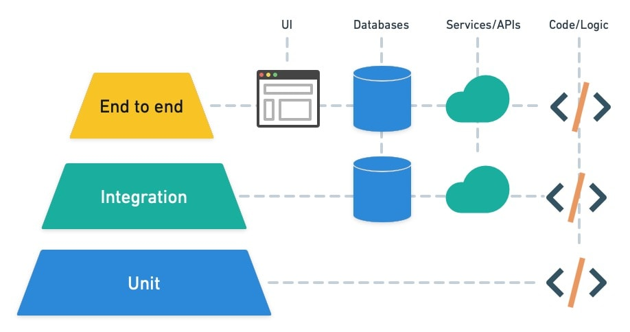

<!-- end_slide -->

Pourquoi des tests automatisés ?
================================

<!-- pause -->

Quand une application est petite, tester manuellement est acceptable.
On lance l'app, on se connecte, on clique, on vérifie. Ça prend 2 minutes.

Mais une application **grandit**.

Plus de fonctionnalités, plus d'équipiers, plus de risques de régression.
À chaque déploiement : est-ce que la connexion marche encore ? Le paiement ? L'inscription ?

On ne peut plus **tout retester à la main** à chaque fois.

<!-- pause -->

**Les tests automatisés résolvent ce problème.**

<!-- column_layout: [1, 1] -->

<!-- column: 0 -->

**Ce qu'on gagne**

- On code une feature + ses tests → c'est plus long au départ
- Mais modifier le code devient **sûr** : si on casse quelque chose, on le sait immédiatement
- Fini les régressions silencieuses découvertes par les utilisateurs

<!-- column: 1 -->

**Le vrai bénéfice**

> Développer **avec confiance** — pas avec l'angoisse de casser quelque chose sans le savoir.

Les tests ne ralentissent pas le développement sur le long terme.
Ils le **sécurisent**.

<!-- reset_layout -->

> Il existe plusieurs types de tests — selon **ce qu'on teste** et à quel niveau.
> Ces trois types coexistent dans un projet.
> On verra comment les doser avec **la pyramide des tests**.

<!-- end_slide -->

<!-- jump_to_middle -->

1 — Les tests unitaires
=======================

<!-- end_slide -->

Les tests unitaires
===================

Un test unitaire vérifie **une seule fonction ou méthode, isolée de tout le reste**. Pas de base de données, pas de réseau, pas de filesystem — tout ce qui est externe est **mocké**.

<!-- pause -->

<!-- column_layout: [1, 1] -->

<!-- column: 0 -->

**Fonction pure — pas de dépendance**

```javascript
// tva.js
export function calculerTVA(prixHT, taux) {
  if (taux < 0 || taux > 1) throw new Error("Taux invalide");
  return prixHT * taux;
}
```

```javascript
// tva.test.js
import { calculerTVA } from "./tva";

test("calcule la TVA au taux normal", () => {
  expect(calculerTVA(100, 0.20)).toBe(20);
});

test("lève une erreur si le taux est invalide", () => {
  expect(() => calculerTVA(100, -0.1)).toThrow("Taux invalide");
});
```

<!-- pause -->

<!-- column: 1 -->

**Fonction avec dépendance externe — mock nécessaire**

```javascript
// commande.js
import { obtenirReduction } from "./reductions";

export async function calculerPrixFinal(articles) {
  const total = articles.reduce((acc, a) => acc + a.prix, 0);
  const reduction = await obtenirReduction(total); // appel BDD
  return total - reduction;
}
```

```javascript
// commande.test.js
import { calculerPrixFinal } from "./commande";

const mockObtenirReduction = jest.fn();
jest.mock("./reductions", () => ({
  obtenirReduction: mockObtenirReduction,
}));

test("applique la réduction au total", async () => {
  mockObtenirReduction.mockResolvedValue(10);
  const articles = [{ prix: 50 }, { prix: 30 }];

  const prix = await calculerPrixFinal(articles);

  expect(prix).toBe(70); // 80 - 10
});
```

<!-- reset_layout -->

<!-- pause -->

> Un mock remplace une dépendance par une version contrôlée,
> pour tester une fonction **sans tester ce qu'elle délègue**.

<!-- pause -->

**Outils** — Node.js/TS : `jest` (standard backend) · `vitest` (projets Vite/frontend) · `node:test` (natif, basique) — Java : `JUnit 5` · `Mockito` (mocks)

<!-- end_slide -->

Les limites des tests unitaires
================================

Les tests unitaires sont rapides et précis — mais ils ne testent que des **pièces isolées**.

<!-- pause -->

<!-- column_layout: [1, 1] -->

<!-- column: 0 -->

**Ce qu'ils détectent ✓**

- Une fonction qui calcule mal
- Un cas limite non géré
- Une régression dans la logique métier

<!-- column: 1 -->

**Ce qu'ils ne voient pas ✗**

- La route Express qui n'appelle pas le bon service
- La requête SQL mal formée
- Une contrainte d'unicité en base non respectée
- Un formulaire qui soumet vers le mauvais endpoint
- Un parcours en plusieurs étapes qui casse à mi-chemin

<!-- reset_layout -->

<!-- pause -->

> Les composants fonctionnent individuellement — mais **fonctionnent-ils ensemble ?**
> C'est la raison pour laquelle on a besoin de tester à des niveaux plus élevés.

<!-- end_slide -->

<!-- jump_to_middle -->

2 — Les tests d'intégration
============================

<!-- end_slide -->

Les tests d'intégration
========================

Un test d'intégration vérifie que **plusieurs composants fonctionnent correctement ensemble**.

<!-- pause -->

<!-- column_layout: [1, 1] -->

<!-- column: 0 -->

**Ce qu'on laisse interagir réellement ✓**

- Routes et contrôleurs
- Services et logique métier
- Base de données
- Cache, job queue...

<!-- column: 1 -->

**Ce qu'on continue de mocker ✗**

- APIs tierces (Stripe, SendGrid...)
- Horloge système (Date.now) pour des tests d'expiration par exemple
- Tout ce qui est extérieur au projet

<!-- reset_layout -->

<!-- pause -->

> Moins de mocks sur le code interne, des tests qui exécutent plusieurs couches à la fois → les tests résistent mieux aux évolutions du code.

<!-- pause -->

**Outils** — Node.js/TS : `jest` ou `vitest` + `supertest` (requêtes HTTP) — Java : `JUnit 5` + `@SpringBootTest` + `MockMvc`

<!-- end_slide -->

Tests d'intégration — exemple Node.js
======================================

On teste la route `POST /users` de bout en bout : validation → service → base.

<!-- column_layout: [1, 1] -->

<!-- column: 0 -->

**L'application Express (`app.js`)**

```javascript
app.post("/users", async (req, res) => {
  const { name, email } = req.body;

  if (!email) {
    return res.status(400).json({ error: "email requis" });
  }

  const existing = await db.query(
    "SELECT id FROM users WHERE email = $1",
    [email]
  );
  if (existing.rows.length > 0) {
    return res.status(409).json({ error: "email déjà pris" });
  }

  const user = await db.query(
    "INSERT INTO users (name, email) VALUES ($1, $2) RETURNING *",
    [name, email]
  );
  res.status(201).json(user.rows[0]);
});
```

<!-- column: 1 -->

**Le test Supertest** (`app.test.js`)

```javascript
import request from "supertest";
import { app } from "./app";
import { db } from "./db";

describe("POST /users", () => {
  test("retourne 400 si email manquant", async () => {
    const res = await request(app)
      .post("/users")
      .send({ name: "Alice" });

    expect(res.status).toBe(400);
    expect(res.body.error).toMatch(/email/);
  });

  test("retourne 409 si email déjà pris", async () => {
    await db.query(
      "INSERT INTO users (email) VALUES ('alice@example.com')"
    );

    const res = await request(app)
      .post("/users")
      .send({ email: "alice@example.com" });

    expect(res.status).toBe(409);
  });
});
```

<!-- reset_layout -->

<!-- end_slide -->

Gérer la base de données en test
==================================

Les tests d'intégration écrivent, modifient, suppriment des données.
Il ne faut surtout pas toucher la base de prod — ni même celle de dev.

<!-- pause -->

**Règle : une base de données dédiée aux tests**, locale, jetable.

L'objectif : que chaque test parte d'un état propre et prévisible.
Le plus simple — une base vide, remise à zéro avant chaque test.

```javascript
// Dans chaque fichier de test, on crée les données dont on a besoin
beforeEach(async () => {
  await db.query("DELETE FROM users");
});

test("retourne 409 si email déjà pris", async () => {
  // On crée explicitement la donnée dans le test
  await db.query("INSERT INTO users (email) VALUES ('alice@example.com')");

  const res = await request(app)
    .post("/users")
    .send({ email: "alice@example.com" });

  expect(res.status).toBe(409);
});
```

<!-- pause -->

> **SQLite** : si l'appli utilise déjà SQLite, une base in-memory est une alternative pratique —
> elle repart de zéro à chaque exécution sans avoir à gérer le reset manuellement.

<!-- end_slide -->

<!-- jump_to_middle -->

3 — Les tests E2E
==================

<!-- end_slide -->

Les tests end-to-end
=====================

Un test E2E simule un **vrai utilisateur** dans un **vrai navigateur**.
Pour l'exécuter, toute l'application doit tourner : frontend, backend, base de données.

<!-- pause -->

<!-- column_layout: [1, 1] -->

<!-- column: 0 -->

**Ce qui se passe pendant le test**

1. L'application est lancée dans un processus séparé
2. Un vrai navigateur (Chromium, Firefox, WebKit) est démarré
3. Le test pilote ce navigateur : navigation, clics, saisie
4. On vérifie ce que l'utilisateur voit à l'écran

<!-- column: 1 -->

**Ce qui est traversé**

- L'interface utilisateur
- Les appels API du frontend
- Le backend et sa logique
- La base de données

Rien n'est mocké — tout tourne réellement.

<!-- reset_layout -->

<!-- pause -->

> Par défaut, le navigateur est lancé en mode **headless** — sans fenêtre visible.
> Avec `--headed`, on peut le voir en action pour débugger.

<!-- pause -->

**Outils** — `Playwright` (multi-navigateur, recommandé) · `Cypress` (JS uniquement)

<!-- end_slide -->

Playwright en pratique
=======================

```javascript
import { test, expect } from "@playwright/test";

test("un utilisateur peut se connecter", async ({ page }) => {
  await page.goto("http://localhost:3000/login");

  await page.fill('[name="email"]', "alice@example.com");
  await page.fill('[name="password"]', "motdepasse");
  await page.click('button[type="submit"]');

  await expect(page).toHaveURL("/dashboard");
  await expect(page.locator("h1")).toContainText("Bonjour Alice");
});
```

<!-- column_layout: [1, 1] -->

<!-- column: 0 -->

**Ce que Playwright peut faire**

- Navigation, clics, saisie de formulaires *(illustré ci-dessus)*
- Tester sur Chromium, Firefox et WebKit en parallèle
- Générer des tests en enregistrant les interactions (`codegen`)
- Intercepter les requêtes réseau — pour continuer de mocker quand nécessaire

<!-- column: 1 -->

**Lancer les tests**

```bash
npx playwright test
# tous les tests

npx playwright test --headed
# avec navigateur visible

npx playwright test login.spec.ts
# un fichier spécifique

npx playwright test --ui
# interface graphique interactive
```

<!-- reset_layout -->

<!-- end_slide -->

Le coût des tests E2E
======================

Les tests E2E sont les plus proches de la réalité utilisateur —
mais les plus coûteux à exécuter et les plus imprévisibles.

<!-- pause -->

<!-- column_layout: [1, 1] -->

<!-- column: 0 -->

**Les problèmes classiques**

- **Tests flaky** : échouent aléatoirement selon le timing réseau ou le rendu
- **Sélecteurs fragiles** : un refacto CSS casse 20 tests
- **Lents** : quelques secondes par test, des minutes pour une suite
- **Difficiles à débugger** : on teste beaucoup de couches à la fois, l'erreur peut être n'importe où

<!-- column: 1 -->

**Les bonnes pratiques**

- Utiliser des attributs dédiés aux tests : `data-testid="submit-btn"`
- Tester uniquement les **parcours critiques** : connexion, paiement, inscription
- Ne pas dupliquer ce qui est déjà couvert en intégration
- Garder la suite E2E petite et stable

<!-- reset_layout -->

<!-- pause -->

> Un test E2E qui échoue aléatoirement est pire qu'aucun test —
> l'équipe finit par ne plus lui faire confiance.

<!-- end_slide -->

<!-- jump_to_middle -->

4 — La pyramide des tests
==========================

<!-- end_slide -->

La pyramide des tests
======================

Maintenant que les trois niveaux sont clairs — combien de chaque ?



<!-- pause -->

<!-- column_layout: [1, 1] -->

<!-- column: 0 -->

**Plus on monte :**

- Plus les tests sont **lents** et gourmands en ressources
- Plus ils sont **coûteux à mettre en place** (base de test, serveur, navigateur...)
- Moins ils sont **précis quand ils échouent** — plus de code traversé, plus difficile d'isoler la cause
- Mais plus ils sont **proches de la réalité utilisateur**

<!-- column: 1 -->

**La règle :**

- **Unitaire** — tester tous les chemins du code (happy path + edge cases)
- **Intégration** — tester les scénarios les plus fréquents en production
- **E2E** — tester uniquement les **parcours utilisateur critiques**, pas plus

<!-- reset_layout -->

<!-- pause -->

> L'inverse — beaucoup d'E2E, peu d'unitaires — donne une suite **lente**, **fragile**,
> qui ne dit pas **où** est le bug quand elle échoue.

<!-- end_slide -->

<!-- jump_to_middle -->

5 — Bonnes pratiques & anti-patterns
======================================

<!-- end_slide -->

Anti-patterns fréquents
========================

<!-- column_layout: [1, 1] -->

<!-- column: 0 -->

**✗ Tests interdépendants**

```javascript
let userId;

test("crée un user", async () => {
  const res = await createUser();
  userId = res.id; // partagé entre tests !
});

test("supprime le user", async () => {
  await deleteUser(userId); // dépend du test 1 !
});
```

<!-- column: 1 -->

**✗ Tester des librairies tierces**

```javascript
async function getUserByEmail(email) {
  return db.user.findFirst({ where: { email } });
}

test("getUserByEmail", async () => {
  await db.insert(users).values({ email: "x@x.com" });
  const user = await getUserByEmail("x@x.com");
  expect(user.email).toBe("x@x.com");
});
```

<!-- reset_layout -->

<!-- pause -->

<!-- column_layout: [1, 1] -->

<!-- column: 0 -->

**✗ Plusieurs cas dans un seul test**

```javascript
test("createUser", async () => {
  const user = await createUser("a@a.com", "secret");
  expect(user.id).toBeDefined();

  await expect(createUser("a@a.com", "other"))
    .rejects.toThrow("Email déjà utilisé");

  await expect(createUser("b@b.com", "x"))
    .rejects.toThrow("Mot de passe trop court");
});
```

<!-- column: 1 -->

**✗ Test pas toujours vrai**

```javascript
test("affiche le message d'erreur", () => {
  showError("Champ requis"); // async, oubli du await
  expect(screen.getByText("Champ requis")).toBeInTheDocument();
});
```

<!-- reset_layout -->

<!-- end_slide -->

Tests en CI/CD
===============

Les tests s'intègrent dans le pipeline d'intégration et de déploiement — souvent dans un ordre précis.

<!-- pause -->

**Ordre d'exécution dans le pipeline :**

1. Tests unitaires → rapides, échouent vite
2. Tests d'intégration → seulement si étape 1 passe
3. Tests E2E → seulement si étape 2 passe

<!-- pause -->

> Vu que les tests E2E peuvent être coûteux et longs, ça peut être une stratégie de les lancer moins souvent que les autres : quand la PR est prête à être mergée, quand elle n'est plus en draft, quand quelqu'un a review le code et approuvé le merge etc.

<!-- end_slide -->

Récap — les trois niveaux
==========================

<!-- column_layout: [1, 1, 1] -->

<!-- column: 0 -->

**Unitaires**

Rapides, précis.
Testent la logique métier en isolation.
Constituent la base de la pyramide.

<!-- column: 1 -->

**Intégration**

Vérifient les interactions réelles entre couches.
Attrapent les bugs de contrat entre modules.

<!-- column: 2 -->

**E2E**

Simulent les interactions utilisateur.
Couvrent les parcours critiques de bout en bout.

<!-- reset_layout -->

<!-- pause -->

<!-- column_layout: [1, 1] -->

<!-- column: 0 -->

**La pyramide**

Le maximum en bas (unitaire),
le minimum en haut (E2E).

<!-- column: 1 -->

**En CI**

Exécuter dans l'ordre.
Bloquer le déploiement si un niveau échoue.

<!-- reset_layout -->

<!-- pause -->

> Des tests bien écrits sont des investissements long-terme —
> ils permettent de **changer le code en confiance**.

<!-- pause -->

> Une bonne suite de tests doit pouvoir servir de **documentation**.
> Si un·e nouveau·elle dev lit vos tests, il·elle comprend ce que le code est censé faire.

<!-- end_slide -->

<!-- jump_to_middle -->

Quiz — Vérifions les acquis
============================

<!-- end_slide -->

Quiz — Question 1
==================

**Quel type de test utiliserait un mock pour remplacer un appel à la base de données ?**

<!-- pause -->

- A) Test E2E
- B) Test unitaire
- C) Test d'intégration
- D) Aucun — on ne mocke jamais la base

<!-- pause -->

> **Réponse : B) Test unitaire**
> Les tests unitaires isolent le code de ses dépendances externes.
> Les tests d'intégration utilisent une vraie base (de test).

<!-- end_slide -->

Quiz — Question 2
==================

**Pourquoi les tests E2E sont-ils placés en haut de la pyramide ?**

<!-- pause -->

- A) Parce qu'ils sont les plus importants
- B) Parce qu'ils sont les plus rapides
- C) Parce qu'ils sont les plus coûteux et doivent rester peu nombreux
- D) Parce qu'ils doivent être exécutés en premier

<!-- pause -->

> **Réponse : C) Parce qu'ils sont les plus coûteux et doivent rester peu nombreux**
> Lents, fragiles, difficiles à débugger — on les réserve aux parcours critiques.

<!-- end_slide -->

Quiz — Question 3
==================

**Quel est le problème avec ce test ?**

```javascript
let userId;

test("crée un user", async () => {
  const res = await createUser();
  userId = res.id;
});

test("supprime le user", async () => {
  await deleteUser(userId);
});
```

<!-- pause -->

- A) Le test est trop long
- B) Les tests sont interdépendants — le test 2 dépend du test 1
- C) Il manque un `expect()`
- D) Il faudrait utiliser Playwright

<!-- pause -->

> **Réponse : B) Les tests sont interdépendants**
> Chaque test doit être autonome. Si le test 1 échoue ou s'exécute après, le test 2 casse.

<!-- end_slide -->

Quiz — Question 4
==================

**Pour tester la route `POST /users` avec une vraie base de données, quel type de test choisir ?**

<!-- pause -->

- A) Test unitaire
- B) Test E2E avec Playwright
- C) Test d'intégration avec Supertest
- D) Test manuel

<!-- pause -->

> **Réponse : C) Test d'intégration avec Supertest**
> On teste route + service + base, sans avoir besoin d'un navigateur.

<!-- end_slide -->

Quiz — Question 5
==================

**Quel est l'ordre d'exécution recommandé en CI ?**

<!-- pause -->

- A) E2E → Intégration → Unitaires
- B) Unitaires → E2E → Intégration
- C) Unitaires → Intégration → E2E
- D) Peu importe, ils sont tous indépendants

<!-- pause -->

> **Réponse : C) Unitaires → Intégration → E2E**
> Du plus rapide au plus lent — on échoue vite si quelque chose est cassé.

<!-- end_slide -->

Quiz — Question 6
==================

**Pourquoi utiliser `data-testid="submit-btn"` plutôt qu'un sélecteur CSS comme `.btn-primary` ?**

<!-- pause -->

- A) C'est plus joli dans le code
- B) Les sélecteurs CSS sont plus lents
- C) Un refacto CSS ne cassera pas les tests E2E
- D) Playwright ne supporte pas les sélecteurs CSS

<!-- pause -->

> **Réponse : C) Un refacto CSS ne cassera pas les tests E2E**
> Les `data-testid` sont dédiés aux tests et découplés du style.

<!-- end_slide -->

<!-- jump_to_middle -->

Bravo ! 🎉
==========
